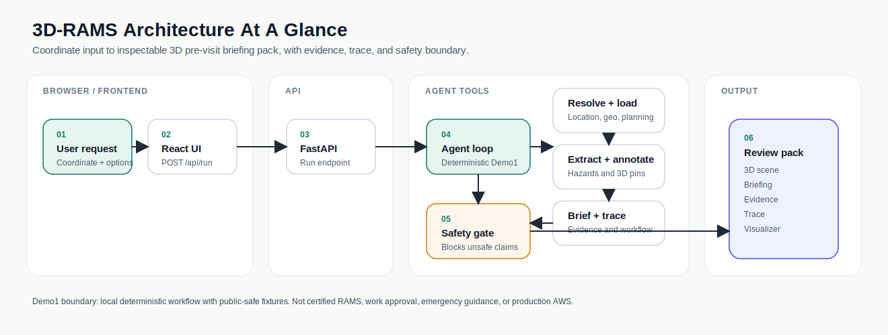

# 3D-RAMS


3D-RAMS is a hackathon Demo1 agent that turns a site coordinate into a 3D pre-visit briefing pack.

The first slice is intentionally local-first: it can run without Google Maps keys, Cesium ion keys, live planning-portal scraping, or hosted infrastructure. The default UI uses a cached public Lambeth / Thames fixture pack, and the production-shaped path can also make one Amazon Bedrock call per run for briefing generation when AWS credentials are configured, while preserving deterministic fallback.

## Problem Statement

Site teams preparing for unfamiliar rural, development, or infrastructure visits have to combine maps, terrain, access routes, planning records, document evidence, and risk notes before they can form a useful briefing. 3D-RAMS explores whether an agent can turn that fragmented digital work into an inspectable 3D pre-visit pack with evidence, annotations, trace, confidence labels, and a visible safety boundary.

Read the full problem statement in [docs/problem-statement.md](docs/problem-statement.md).

## Architecture At A Glance



This rendered diagram is the README-scale view of the workflow in [docs/architecture.md](docs/architecture.md). The detailed architecture document remains the source of truth for the full Mermaid diagrams, trust boundaries, real-vs-mocked register, safety gate, and future AWS path.

## Demo Workflow

1. User enters a coordinate or selects the cached public Lambeth data pack.
2. The AgentCore runtime resolves the selected fixture pack or synthetic fallback.
3. The agent loads cached-public, synthetic, or fallback geospatial features.
4. The agent builds a Cesium scene configuration.
5. The agent loads cached-public or synthetic planning/context notes.
6. The agent extracts candidate hazard notes.
7. The agent creates 3D annotations.
8. The agent generates a RAMS-style briefing.
9. A safety gate blocks certified RAMS, work approval, and emergency guidance claims.
10. The UI shows the 3D scene, briefing, evidence register, trace, and architecture visualizer.

## Real vs Mocked

| Component | Demo1 Status | Notes |
| --- | --- | --- |
| Agent workflow | Real Python code | Tool sequence, evidence, trace, safety gate, deterministic fallback, and response shape are implemented. |
| Public data pack | Cached public fixture | `fixtures/public-lambeth-thames` includes source metadata for a Lambeth / Thames public-data pack anchored on 8 Albert Embankment. Runtime makes no live public-data calls. |
| Bedrock briefing | Optional live AWS path | Uses one `InvokeModel` call per run when `ENABLE_BEDROCK=true`; deterministic briefing remains the fallback. |
| 3D viewer | Real React/Vite + CesiumJS UI | Uses a token-free Cesium canvas plus local scene overlay and annotations. |
| Geospatial features | Cached-public or mocked fixture | Default pack uses cached public-source metadata; synthetic fallback uses `fixtures/geospatial_features.json`. |
| Planning/context notes | Cached-public or synthetic fixture | Default pack uses cached public-safe notes and source metadata; synthetic fallback uses `fixtures/planning_report.txt`. |
| AWS | Partially live when configured | Bedrock briefing can be live; DynamoDB, S3, CloudWatch, Guardrails, and AgentCore remain production-path stages. |
| Google Maps / Earth / 3D Tiles | Not used | Kept out of Demo1 to avoid key, cost, licensing, and freshness risk. |

## Quickstart

## Teammate Testing

The easiest teammate test path is GitHub Codespaces. Open the repo in Codespaces, then run:

```bash
bash scripts/start-dev.sh
```

Codespaces should forward the frontend on port `5173` and AgentCore runtime on port `8080`. Use [docs/team-test-guide.md](docs/team-test-guide.md) for the scenario checklist and feedback template.

No AWS, Google Maps, Cesium ion token, or real site data is required.

The UI defaults to the cached `public-lambeth-thames` pack. Use the `Data pack` control to switch to the older synthetic fixture path.

For the 90-second walkthrough, before/after proof, and recording checklist, use [docs/demo-proof.md](docs/demo-proof.md).

For measured impact without overclaiming speed-up, use [docs/impact-baseline.md](docs/impact-baseline.md).

For a step-by-step fallback recording sequence and pass/fail criteria, use [docs/demo-recording-runbook.md](docs/demo-recording-runbook.md).

For repeatable local proof of the AgentCore workflow, run:

```bash
python scripts/evaluate-demo.py
```

The evaluation runner covers nine deterministic scenarios, including cached-public happy path, missing planning evidence, map fallback, Bedrock-disabled fallback, unsafe request blocking, low-confidence output, architecture payload shape, and unknown pack fallback. See [docs/evaluation.md](docs/evaluation.md).

GitHub Actions also runs the AgentCore tests, deterministic evaluation, frontend build, and HTTP runtime smoke on pushes and pull requests. See [docs/mvp-readiness.md](docs/mvp-readiness.md) for the current readiness snapshot, verified scenarios, and remaining gates.

For contribution expectations, safety boundaries, and handoff checklist, see [CONTRIBUTING.md](CONTRIBUTING.md).

For AgentCore invocation shape and validation behavior, see [docs/api-contract.md](docs/api-contract.md).

For the AgentVerse entry-agent and AWS AgentCore adapter boundary, see [docs/agentverse-agentcore-adapter-contract.md](docs/agentverse-agentcore-adapter-contract.md) and [ADR 0004](docs/adr/0004-agentverse-entry-agent-adapter-boundary.md).

For the imported ASI:ONE / AgentVerse proof of concept runtime and `@3d-rams` hosted adapter shape, see [docs/agentverse-asi-one-runtime.md](docs/agentverse-asi-one-runtime.md).

To run the full local verification stack before sharing changes in Codespaces/Linux/macOS:

```bash
bash scripts/check-demo.sh
```

On a fresh Codespace or local clone, install dependencies as part of the check:

```bash
bash scripts/check-demo.sh --install
```

On Windows PowerShell:

```powershell
powershell -ExecutionPolicy Bypass -File scripts/check-demo.ps1
```

On a fresh Windows clone:

```powershell
powershell -ExecutionPolicy Bypass -File scripts/check-demo.ps1 -Install
```

The check runs AgentCore package tests, deterministic evaluation, frontend production build, and a no-AWS HTTP runtime smoke against AgentCore and the frontend preview.

## Bedrock Mode

The app defaults to deterministic fallback unless the AgentCore runtime is started with Bedrock enabled.

Use the full optional setup guide in [docs/aws-bedrock-setup.md](docs/aws-bedrock-setup.md). Confirm cost guardrails before repeated live testing; the current recommendation is a small budget alert, one Bedrock call per agent run, `BEDROCK_MAX_TOKENS=1200`, and `BEDROCK_TEMPERATURE=0.2`.

Recommended local settings:

```bash
ENABLE_BEDROCK=true
AWS_PROFILE=3d-rams-dev
AWS_REGION=eu-west-2
BEDROCK_MODEL_ID=anthropic.claude-3-7-sonnet-20250219-v1:0
BEDROCK_MAX_TOKENS=1200
BEDROCK_TEMPERATURE=0.2
```

Run a low-volume smoke test:

```bash
python scripts/bedrock-smoke.py
```

Do not commit `.env`, AWS credentials, SSO cache files, API keys, or real client/site data. The UI shows whether a run used Bedrock, deterministic mode, or fallback.

## Local Quickstart

AgentCore runtime:

```bash
agentcore dev --runtime rams_agentcore --skip-deploy --no-browser --no-traces --logs --port 8080
```

Frontend:

```bash
cd frontend
npm install
npm run dev
```

Open `http://localhost:5173`.

Health check:

```bash
curl http://localhost:8080/ping
```

AgentCore invocation:

```bash
curl -X POST http://localhost:8080/invocations ^
  -H "Content-Type: application/json" ^
  -d "{\"input\":{\"latitude\":52.2053,\"longitude\":-1.6022}}"
```

## Demo Scenarios

| Scenario | How to Run | Expected Result |
| --- | --- | --- |
| Happy path | Click `Run` | Scene, annotations, briefing, evidence, and trace are returned. |
| Cached public pack | Leave `Data pack` as `Lambeth public cache`, click `Run` | Sources include cached Planning Data / flood context and OSM-style access context with attribution and freshness labels. |
| Missing data | Disable `Planning fixture`, click `Run` | Briefing continues with a planning-evidence limitation. |
| Tool failure | Enable `Map fallback`, click `Run` | Trace marks geospatial loading as `fallback`. |
| Bedrock fallback | Enable Bedrock in UI while AgentCore has no AWS config, or set `BEDROCK_SIMULATE_FAILURE=true` | Trace marks Bedrock step as `disabled` or `fallback`; deterministic briefing remains available. |
| Unsafe request | Click `Safety test` | Safety gate blocks certified RAMS/work approval behavior. |
| Low confidence | Normal run | Imagery-derived bridge indicator is labelled low confidence. |
| Architecture visualizer | Normal run | UI shows tool sequence, boundaries, AWS path, and real-vs-mocked status. |

## AWS Production Path

Demo1 trace and response objects are shaped to map naturally to an AWS implementation:

- Amazon Bedrock for the live model-assisted briefing step.
- DynamoDB for versioned project state, approvals, and rollback records.
- S3 for evidence packs, exported briefings, screenshots, and source documents.
- CloudWatch for trace, latency, cost, and failure visibility.
- Guardrails for unsafe claim and policy filtering.
- AgentCore Runtime and Observability as a stretch layer after the plain Bedrock-backed loop works.

See [docs/architecture.md](docs/architecture.md) for the workflow and AWS diagrams.

## Safety Boundary

This project does not produce certified RAMS, emergency response instructions, work approval, or competent-person replacement. It produces an inspectable pre-visit review pack for human review.
