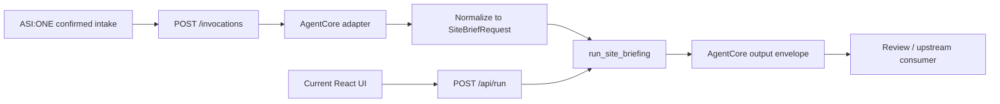

# ADR 0003: AgentCore CLI Harness Configuration And Migration Plan

## Status

Proposed for implementation planning.

## Context

ADR 0001 decided that AgentCore should own the production-shaped runtime boundary, while AgentVerse or the relevant registry/catalog surface should remain the entry and discovery layer. ADR 0002 defined the intended workflow: ASI:ONE guided intake, supervisor planning, specialist subagents and tools, Tavily-backed open-web signals, supervisor reasoning, independent review agents, then frontend visualization from review-passed structured JSON.

The current repository is not an AgentCore project yet. It contains a local-first FastAPI backend, a React frontend, deterministic fixtures, optional Bedrock briefing, tests, evaluation scripts, and public-safe docs. It does not contain `agentcore/agentcore.json`, `agentcore/aws-targets.json`, CDK output, Dockerfile, AgentCore runtime wrapper, AgentCore Harness config, or AWS deployment state.

This ADR evaluates how to configure a future AgentCore project using the latest CLI checked on 2026-06-29.

## Latest CLI Findings

The latest npm dist-tag checked locally was:

```bash
npm view @aws/agentcore version dist-tags
```

Result:

- `latest`: `0.21.1`;
- `preview`: `1.0.0-preview.18`.

`npx -y @aws/agentcore@0.21.1 --help` showed the relevant command surface:

- project lifecycle: `create`, `dev`, `deploy`, `invoke`, `package`, `validate`;
- deployed runtime operations: `status`, `logs`, `traces`, `exec`;
- project import: `import`;
- resource registration: `add agent`, `add harness`, `add tool`, `add skill`, `add memory`, `add gateway`, `add policy-engine`, `add policy`, `add config-bundle`;
- Harness export: `export harness`.

The latest CLI treats Harness as a declarative bundle of runtime, model, tools, skills, memory, and observability. The relevant Harness options include:

- model/provider: `--model-provider`, `--model-id`, `--api-format`;
- loop controls: `--max-iterations`, `--max-tokens`, `--timeout`, `--truncation-strategy`;
- tool controls: `--allowed-tools`, `add tool`, `add skill`;
- deployment controls: `--container`, `--network-mode`, VPC settings, session storage, EFS/S3 mounts;
- auth and policy-adjacent controls: custom JWT settings, gateway auth settings, environment variables, tags.

Dry-run checks showed that `agentcore create` has two important paths:

1. Runtime-agent path, using flags such as `--language`, `--framework`, `--model-provider`, `--memory`, `--protocol`, and `--build`.
2. Harness path, using flags such as `--model-id`, `--max-iterations`, `--timeout`, and `--truncation-strategy`.

The CLI rejects mixing these two paths in one `create` command. Therefore the migration should not expect a single command to create both the custom runtime wrapper and the full Harness configuration.

Dry-run also showed the scaffold shape:

- `agentcore/agentcore.json`;
- `agentcore/aws-targets.json`;
- `agentcore/.env.local`;
- `agentcore/cdk/`;
- `app/<agent-or-harness>/main.py` and `pyproject.toml` for runtime-agent scaffolds;
- `app/<harness>/harness.json` and `system-prompt.md` for Harness scaffolds.

## Decision

Use an AgentCore CLI scaffold-first migration. The next implementation should let the AgentCore CLI create the canonical project folders and config files first, then move or bridge the current 3D-RAMS code into those generated locations.

This is a change from a hand-rolled wrapper-first approach. The repo should follow AgentCore conventions where they exist, especially for:

- `agentcore/` project configuration;
- `agentcore/cdk/` deployment infrastructure generated by the CLI;
- `app/<agent-name>/` runtime source and packaging metadata;
- `app/<harness-name>/` Harness configuration and system prompt;
- CLI validation, package, deploy, invoke, logs, and traces workflows.

The first AgentCore-compatible implementation should still preserve the current deterministic behavior, but it should be placed inside the generated AgentCore runtime package instead of remaining only in the legacy `backend/` tree.

The migration should:

- run AgentCore CLI scaffold commands in a reviewed branch or scratch directory first;
- keep generated file layout and naming conventions unless there is a concrete reason to change them;
- move the current `backend/app` code into an importable package under `app/rams_agentcore/`;
- move or copy runtime-required fixtures into the AgentCore package so CodeZip/container packaging includes them;
- keep `backend/` as a local compatibility layer only while the frontend and existing tests are being migrated;
- add `/ping` and `/invocations` in the AgentCore runtime entrypoint;
- map ASI:ONE confirmed intake payloads into the current `SiteBriefRequest` shape;
- return the current run object inside an AgentCore-compatible `output` envelope;
- preserve fixture and mock modes as first-class runtime modes, not hidden prompt behavior;
- keep Bedrock optional and controlled by environment variables;
- use AgentCore CLI `validate` and `package` before any deploy attempt;
- defer `deploy` until IAM, account, region, cost guardrails, and safety review are ready.

Harness should be added through the CLI as a supervisor configuration layer:

- model provider and model id;
- max iterations, max tokens, timeout, and truncation strategy;
- allowed tools and future specialist tool registry;
- memory disabled by default for Demo1 unless a reviewed use case needs it;
- public network mode first, with VPC only when private data sources require it;
- environment flags that keep fixture/mock mode explicit.

## Target Repo Shape

The existing repository should become an AgentCore project root after the CLI scaffold is merged into it. The target shape is:

```text
agentcore/
  agentcore.json
  aws-targets.json
  .env.local.example
  cdk/

app/rams_agentcore/
  main.py
  pyproject.toml
  README.md
  three_d_rams/
    __init__.py
    agent.py
    agentcore_adapter.py
    bedrock_adapter.py
    config.py
    fixtures.py
    models.py
    tools.py
  fixtures/
    geospatial_features.json
    planning_report.txt
    public-lambeth-thames/
      ...
  tests/
    test_agent.py
    test_invocations.py

app/rams_supervisor/
  harness.json
  system-prompt.md

backend/
  app/
    main.py
  tests/
    ...

frontend/
docs/
scripts/
```

`app/rams_agentcore/main.py` should be the AgentCore runtime entrypoint. It should expose `/ping` and `/invocations` and import the migrated `three_d_rams` package. It should not duplicate workflow logic.

`backend/app/main.py` can remain temporarily as a local FastAPI compatibility app for the current React UI. It should import the same migrated `three_d_rams` package, so there is only one workflow implementation.

`agentcore/.env.local` must remain untracked. Public examples can use `.env.local.example` only, with placeholders and no secrets.

## Existing Asset Placement

All current repo assets need an AgentCore convention-aware destination:

| Current Asset | Target Location | Rationale |
| --- | --- | --- |
| `backend/app/agent.py` | `app/rams_agentcore/three_d_rams/agent.py` | Core workflow must be packaged with the AgentCore runtime. |
| `backend/app/tools.py` | `app/rams_agentcore/three_d_rams/tools.py` | Tool functions become the source for inline/gateway tool wrappers. |
| `backend/app/models.py` | `app/rams_agentcore/three_d_rams/models.py` | Request schema should be shared by local API and `/invocations`. |
| `backend/app/bedrock_adapter.py` | `app/rams_agentcore/three_d_rams/bedrock_adapter.py` | Optional model step remains runtime-local and environment-controlled. |
| `backend/app/config.py` | `app/rams_agentcore/three_d_rams/config.py` | Runtime env parsing belongs in the deployable package. |
| `backend/app/fixtures.py` | `app/rams_agentcore/three_d_rams/fixtures.py` | Fixture loading should resolve packaged fixture paths. |
| `backend/app/main.py` | `backend/app/main.py` plus `app/rams_agentcore/main.py` | Local `/api/run` remains during transition; AgentCore entrypoint owns `/ping` and `/invocations`. |
| `fixtures/` | `app/rams_agentcore/fixtures/` | Runtime-required fixture/mock data must be included in AgentCore packaging. Root fixtures can remain as local source copies during transition. |
| `backend/tests/` | `app/rams_agentcore/tests/` plus local compatibility tests | AgentCore runtime tests should travel with the package; local API tests can remain while `/api/run` exists. |
| `scripts/evaluate-demo.py` | `scripts/evaluate-demo.py`, later importing `app/rams_agentcore` package | Evaluation harness remains repo-level but should call the packaged workflow. |
| `scripts/check-demo.sh` and `.ps1` | `scripts/` | Repo-level verification should add AgentCore validate/package checks when config lands. |
| `frontend/` | `frontend/` | Frontend is not an AgentCore runtime artifact; it remains a separate client consuming local or deployed endpoints. |
| `docs/` and ADRs | `docs/` | Public architecture and decision history remain repo-level. |
| `.github/` | `.github/` | CI remains repo-level and should later run AgentCore validation/package checks. |
| `.env.example` | `.env.example` and `agentcore/.env.local.example` | Keep public env examples; never commit generated `.env.local` or secrets. |

## Invocation Contract

AgentCore custom runtime documentation requires:

- `GET /ping` for health checks;
- `POST /invocations` for agent interactions;
- an ARM64 package/container when using custom deployment;
- port `8080` for the deployed server path.

The current API exposes:

- `GET /health`;
- `POST /api/run`.

The migration should add compatibility instead of replacing the local demo API:



Recommended request shape:

```json
{
  "input": {
    "siteName": "optional label",
    "latitude": 51.4908,
    "longitude": -0.1216,
    "locationText": "near 8 Albert Embankment",
    "goal": "Pre-visit RAMS scoping pack",
    "fixturePack": "public-lambeth-thames",
    "includePlanningFixture": true,
    "simulateMapFailure": false,
    "useBedrock": false,
    "additionalRequest": "",
    "upstream": {
      "source": "ASI_ONE",
      "sessionId": "opaque-session-id",
      "confirmedByUser": true
    }
  }
}
```

Recommended response shape:

```json
{
  "output": {
    "reportStatus": "review_required",
    "workflowMode": "cached_public_fixture",
    "run": {}
  }
}
```

`run` should initially be the existing `/api/run` response. Later, after the review-agent loop is implemented, `reportStatus` can move from `review_required` to `review_passed` only when the independent review agents pass the structured report JSON.

## Harness Configuration Guidance

Recommended first Harness defaults:

```bash
agentcore add harness \
  --name rams_supervisor \
  --model-provider bedrock \
  --model-id anthropic.claude-3-7-sonnet-20250219-v1:0 \
  --api-format converse_stream \
  --no-memory \
  --max-iterations 8 \
  --max-tokens 12000 \
  --timeout 300 \
  --truncation-strategy summarization \
  --allowed-tools "resolve_location,load_geospatial_features,load_planning_context,extract_hazard_notes,create_annotations,generate_site_brief,review_report" \
  --env ENABLE_BEDROCK=false \
  --env RUNTIME_DATA_MODE=fixture_first
```

This command is a design target, not a command to run before account, region, IAM, and generated config review are complete.

Tool registration should start with inline or gateway-backed wrappers around current functions:

- `resolve_location`;
- `load_geospatial_features`;
- `load_planning_context`;
- `extract_hazard_notes`;
- `create_annotations`;
- `generate_site_brief`;
- `review_report`;
- later: `tavily_open_web_search`.

Tavily must be added only after credential handling and source-quality boundaries are explicit. Open-web findings should be treated as signals that require references and confidence labels, not as authoritative professional evidence.

## Scaffold Command Sequence

Use CLI-generated files as the starting point. Do not hand-author `agentcore/agentcore.json`, `agentcore/aws-targets.json`, or the CDK scaffold from memory.

Recommended first dry-run commands:

```bash
npx -y @aws/agentcore@0.21.1 create \
  --name rams_agentcore \
  --project-name RamsAgent \
  --defaults \
  --language Python \
  --framework Strands \
  --model-provider Bedrock \
  --memory none \
  --protocol HTTP \
  --build CodeZip \
  --skip-install \
  --skip-python-setup \
  --skip-git \
  --dry-run \
  --json
```

```bash
npx -y @aws/agentcore@0.21.1 create \
  --name rams_supervisor \
  --project-name RamsHarness \
  --defaults \
  --model-provider Bedrock \
  --model-id anthropic.claude-3-7-sonnet-20250219-v1:0 \
  --max-iterations 8 \
  --max-tokens 12000 \
  --timeout 300 \
  --truncation-strategy summarization \
  --skip-install \
  --skip-python-setup \
  --skip-git \
  --dry-run \
  --json
```

After dry-run review, run the scaffold into a temporary directory or isolated branch, inspect the generated layout, then merge the reviewed structure into this repo. If the generated file names differ from this ADR because the CLI changed, prefer the CLI convention and update this ADR.

## Migration Steps

1. Run AgentCore CLI runtime and Harness scaffold dry-runs and save the reviewed command output in the implementation notes.
2. Generate the scaffold in a temporary directory or isolated branch.
3. Merge the generated `agentcore/`, `agentcore/cdk/`, `app/rams_agentcore/`, and `app/rams_supervisor/` structure into this repository.
4. Replace the generated placeholder runtime logic with imports from `app/rams_agentcore/three_d_rams`.
5. Move current `backend/app/*.py` modules into `app/rams_agentcore/three_d_rams/`.
6. Move or copy runtime-required fixture data into `app/rams_agentcore/fixtures/` and update fixture path resolution.
7. Implement `app/rams_agentcore/main.py` with `GET /ping` and `POST /invocations`.
8. Keep `backend/app/main.py` as a compatibility wrapper for `/health` and `/api/run`, importing the same packaged workflow.
9. Move core workflow tests into `app/rams_agentcore/tests/` and add AgentCore invocation tests.
10. Keep frontend code in `frontend/`, but allow it to target either local `/api/run` or the AgentCore invocation adapter through config.
11. Add `agentcore/.env.local.example`; keep generated or real `agentcore/.env.local` untracked.
12. Add Harness config through the CLI, then register tools with `agentcore add tool` or an AgentCore Gateway/MCP path once tool schemas are fixed.
13. Update `scripts/check-demo.sh` and CI to run local tests plus `agentcore validate -d .`.
14. Run `agentcore package -d .` before any deploy.
15. Only then evaluate `agentcore deploy --dry-run`, followed by real deploy after AWS account, region, IAM, budget, and safety checks are complete.

## Why Not Harness-Only First

Harness-only configuration is attractive because it can bundle model, tools, skills, memory, and observability declaratively. However, using it as the first migration step would hide too much of the current system's tested behavior:

- deterministic fixtures and cached public packs;
- explicit source register;
- evidence ids and trace ids;
- safety gate behavior;
- mocked vs real vs fallback disclosure;
- existing backend tests and deterministic evaluation scenarios;
- current frontend response contract.

The least painful migration keeps those parts stable, but places them inside the CLI-generated AgentCore runtime package before adding Harness orchestration around them.

## Verification Plan

Before any AWS deployment claim:

- run `bash scripts/check-demo.sh`;
- run focused adapter/API tests for `/ping` and `/invocations`;
- run `agentcore validate -d .`;
- run `agentcore package -d .`;
- run `agentcore deploy --dry-run`;
- document skipped checks and blockers.

No ADR, README, UI, or demo script should claim production deployment until a real AgentCore deployment has passed smoke tests and the deployed runtime can be invoked through AgentCore.

## Risks And Open Questions

- The exact ASI:ONE upstream payload shape is not defined yet.
- The report JSON schema and review-agent pass/fail contract are not defined yet.
- The choice between inline functions, AgentCore Gateway, remote MCP, or custom HTTP tools needs a tool-by-tool decision.
- The team must decide whether to package as `CodeZip` first or use a container when native/system dependencies appear.
- IAM roles, region, budget guardrails, secrets handling, and Tavily credential storage must be settled before deployment.
- Memory should remain disabled until the team defines what user/session data may be retained.

## Next Review Trigger

Revisit this ADR after the team defines:

- the ASI:ONE intake payload;
- the structured report JSON schema;
- the subagent/tool list and tool input/output schemas;
- the review-agent contract;
- the AWS account, region, IAM role, and budget guardrails.

At that point, implement the AgentCore adapter and run the CLI validation/package path against the repository root.
