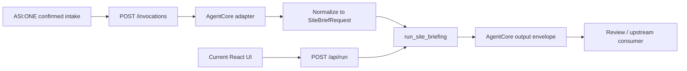

# ADR 0003: AgentCore CLI Harness Configuration And Migration Plan

## Status

Proposed for implementation planning.

## Context

ADR 0001 decided that AgentCore should own the production-shaped runtime boundary, while AgentVerse or the relevant registry/catalog surface should remain the entry and discovery layer. ADR 0002 defined the intended workflow: ASI:ONE guided intake, supervisor planning, specialist subagents and tools, Tavily-backed open-web signals, supervisor reasoning, independent review agents, then frontend visualization from review-passed structured JSON.

The current repository is not an AgentCore project yet. It contains a local-first FastAPI backend, a React frontend, deterministic fixtures, optional Bedrock briefing, tests, evaluation scripts, and public-safe docs. It does not contain `agentcore/agentcore.json`, `agentcore/aws-targets.json`, CDK output, Dockerfile, AgentCore runtime wrapper, AgentCore Harness config, or AWS deployment state.

This ADR evaluates how to configure a future AgentCore project using the latest CLI checked on 2026-06-29.

## Latest CLI Findings

The latest npm dist-tag checked locally was:

```bash
npm view @aws/agentcore version dist-tags
```

Result:

- `latest`: `0.21.1`;
- `preview`: `1.0.0-preview.18`.

`npx -y @aws/agentcore@0.21.1 --help` showed the relevant command surface:

- project lifecycle: `create`, `dev`, `deploy`, `invoke`, `package`, `validate`;
- deployed runtime operations: `status`, `logs`, `traces`, `exec`;
- project import: `import`;
- resource registration: `add agent`, `add harness`, `add tool`, `add skill`, `add memory`, `add gateway`, `add policy-engine`, `add policy`, `add config-bundle`;
- Harness export: `export harness`.

The latest CLI treats Harness as a declarative bundle of runtime, model, tools, skills, memory, and observability. The relevant Harness options include:

- model/provider: `--model-provider`, `--model-id`, `--api-format`;
- loop controls: `--max-iterations`, `--max-tokens`, `--timeout`, `--truncation-strategy`;
- tool controls: `--allowed-tools`, `add tool`, `add skill`;
- deployment controls: `--container`, `--network-mode`, VPC settings, session storage, EFS/S3 mounts;
- auth and policy-adjacent controls: custom JWT settings, gateway auth settings, environment variables, tags.

Dry-run checks showed that `agentcore create` has two important paths:

1. Runtime-agent path, using flags such as `--language`, `--framework`, `--model-provider`, `--memory`, `--protocol`, and `--build`.
2. Harness path, using flags such as `--model-id`, `--max-iterations`, `--timeout`, and `--truncation-strategy`.

The CLI rejects mixing these two paths in one `create` command. Therefore the migration should not expect a single command to create both the custom runtime wrapper and the full Harness configuration.

Dry-run also showed the scaffold shape:

- `agentcore/agentcore.json`;
- `agentcore/aws-targets.json`;
- `agentcore/.env.local`;
- `agentcore/cdk/`;
- `app/<agent-or-harness>/main.py` and `pyproject.toml` for runtime-agent scaffolds;
- `app/<harness>/harness.json` and `system-prompt.md` for Harness scaffolds.

## Decision

Use a runtime-first migration, with Harness added as a supervisor configuration layer after the current backend has an AgentCore-compatible invocation contract.

Do not begin by rewriting the current deterministic workflow into Harness-only prompt/tool configuration. The existing Python functions, fixtures, trace rows, safety gate, tests, and evaluation runner are valuable and should remain the source of truth during the migration.

The first AgentCore-compatible implementation should:

- keep `backend/app/agent.py::run_site_briefing()` as the core workflow function;
- add a thin AgentCore adapter exposing `/ping` and `/invocations`;
- map ASI:ONE confirmed intake payloads into the current `SiteBriefRequest` shape;
- return the current run object inside an AgentCore-compatible `output` envelope;
- preserve fixture and mock modes as first-class runtime modes, not hidden prompt behavior;
- keep Bedrock optional and controlled by environment variables;
- use AgentCore CLI `validate` and `package` before any deploy attempt;
- defer `deploy` until IAM, account, region, cost guardrails, and safety review are ready.

Harness should then be used to declare supervisor-level runtime constraints:

- model provider and model id;
- max iterations, max tokens, timeout, and truncation strategy;
- allowed tools and future specialist tool registry;
- memory disabled by default for Demo1 unless a reviewed use case needs it;
- public network mode first, with VPC only when private data sources require it;
- environment flags that keep fixture/mock mode explicit.

## Target Repo Shape

The existing repository should become the AgentCore project root, rather than moving all code into a separate generated scaffold. A future implementation should add:

```text
agentcore/
  agentcore.json
  aws-targets.json
  .env.local.example
  cdk/

backend/app/agentcore_adapter.py
backend/app/main.py
backend/app/agent.py
backend/app/tools.py

app/rams_agentcore/
  main.py
  pyproject.toml
  README.md
```

`app/rams_agentcore/main.py` should be a small packaging entrypoint that imports the existing backend app or adapter. It should not duplicate the workflow logic.

`agentcore/.env.local` must remain untracked. Public examples can use `.env.local.example` only, with placeholders and no secrets.

## Invocation Contract

AgentCore custom runtime documentation requires:

- `GET /ping` for health checks;
- `POST /invocations` for agent interactions;
- an ARM64 package/container when using custom deployment;
- port `8080` for the deployed server path.

The current API exposes:

- `GET /health`;
- `POST /api/run`.

The migration should add compatibility instead of replacing the local demo API:



Recommended request shape:

```json
{
  "input": {
    "siteName": "optional label",
    "latitude": 51.4908,
    "longitude": -0.1216,
    "locationText": "near 8 Albert Embankment",
    "goal": "Pre-visit RAMS scoping pack",
    "fixturePack": "public-lambeth-thames",
    "includePlanningFixture": true,
    "simulateMapFailure": false,
    "useBedrock": false,
    "additionalRequest": "",
    "upstream": {
      "source": "ASI_ONE",
      "sessionId": "opaque-session-id",
      "confirmedByUser": true
    }
  }
}
```

Recommended response shape:

```json
{
  "output": {
    "reportStatus": "review_required",
    "workflowMode": "cached_public_fixture",
    "run": {}
  }
}
```

`run` should initially be the existing `/api/run` response. Later, after the review-agent loop is implemented, `reportStatus` can move from `review_required` to `review_passed` only when the independent review agents pass the structured report JSON.

## Harness Configuration Guidance

Recommended first Harness defaults:

```bash
agentcore add harness \
  --name rams_supervisor \
  --model-provider bedrock \
  --model-id anthropic.claude-3-7-sonnet-20250219-v1:0 \
  --api-format converse_stream \
  --no-memory \
  --max-iterations 8 \
  --max-tokens 12000 \
  --timeout 300 \
  --truncation-strategy summarization \
  --allowed-tools "resolve_location,load_geospatial_features,load_planning_context,extract_hazard_notes,create_annotations,generate_site_brief,review_report" \
  --env ENABLE_BEDROCK=false \
  --env RUNTIME_DATA_MODE=fixture_first
```

This command is a design target, not a command to run before account, region, IAM, and generated config review are complete.

Tool registration should start with inline or gateway-backed wrappers around current functions:

- `resolve_location`;
- `load_geospatial_features`;
- `load_planning_context`;
- `extract_hazard_notes`;
- `create_annotations`;
- `generate_site_brief`;
- `review_report`;
- later: `tavily_open_web_search`.

Tavily must be added only after credential handling and source-quality boundaries are explicit. Open-web findings should be treated as signals that require references and confidence labels, not as authoritative professional evidence.

## Migration Steps

1. Add `backend/app/agentcore_adapter.py` with `/ping` and `/invocations`.
2. Add tests proving `/invocations` returns the same core payload as `/api/run` under fixture mode.
3. Add `app/rams_agentcore/main.py` as a thin packaging entrypoint that imports the adapter.
4. Add `app/rams_agentcore/pyproject.toml` or equivalent packaging metadata without duplicating dependencies unnecessarily.
5. Generate an AgentCore scaffold in a scratch directory using CLI `--dry-run` first, then copy only reviewed config patterns into the repo.
6. Add `agentcore/agentcore.json` and `agentcore/aws-targets.json` with non-secret, reviewable defaults.
7. Add `.env.local.example`; keep real `.env.local` untracked.
8. Run `agentcore validate -d .`.
9. Run `agentcore package -d .` before any deploy.
10. Only then evaluate `agentcore deploy --dry-run`, followed by real deploy after AWS account, region, IAM, budget, and safety checks are complete.

## Why Not Harness-Only First

Harness-only configuration is attractive because it can bundle model, tools, skills, memory, and observability declaratively. However, using it as the first migration step would hide too much of the current system's tested behavior:

- deterministic fixtures and cached public packs;
- explicit source register;
- evidence ids and trace ids;
- safety gate behavior;
- mocked vs real vs fallback disclosure;
- existing backend tests and deterministic evaluation scenarios;
- current frontend response contract.

The least painful migration keeps those parts stable and wraps them with AgentCore-compatible runtime endpoints first.

## Verification Plan

Before any AWS deployment claim:

- run `bash scripts/check-demo.sh`;
- run focused adapter/API tests for `/ping` and `/invocations`;
- run `agentcore validate -d .`;
- run `agentcore package -d .`;
- run `agentcore deploy --dry-run`;
- document skipped checks and blockers.

No ADR, README, UI, or demo script should claim production deployment until a real AgentCore deployment has passed smoke tests and the deployed runtime can be invoked through AgentCore.

## Risks And Open Questions

- The exact ASI:ONE upstream payload shape is not defined yet.
- The report JSON schema and review-agent pass/fail contract are not defined yet.
- The choice between inline functions, AgentCore Gateway, remote MCP, or custom HTTP tools needs a tool-by-tool decision.
- The team must decide whether to package as `CodeZip` first or use a container when native/system dependencies appear.
- IAM roles, region, budget guardrails, secrets handling, and Tavily credential storage must be settled before deployment.
- Memory should remain disabled until the team defines what user/session data may be retained.

## Next Review Trigger

Revisit this ADR after the team defines:

- the ASI:ONE intake payload;
- the structured report JSON schema;
- the subagent/tool list and tool input/output schemas;
- the review-agent contract;
- the AWS account, region, IAM role, and budget guardrails.

At that point, implement the AgentCore adapter and run the CLI validation/package path against the repository root.
