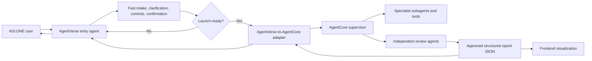

# ADR 0004: AgentVerse Entry Agent And AgentCore Adapter Boundary

## Status

Accepted for implementation planning.

## Context

ADR 0001 set the AgentVerse/AgentCore boundary. ADR 0002 defined the target workflow: ASI:ONE guided intake, supervisor planning, specialist evidence collection, review-agent gate, and frontend visualization. ADR 0003 moved the former FastAPI backend into an AgentCore CLI-shaped runtime.

Follow-up testing found that ASI:ONE cannot be treated as a direct public caller of the AWS AgentCore runtime in the current path. The user-facing entry agent therefore needs to live in AgentVerse, while the deeper supervisor workflow stays in AgentCore. The connection between them needs an explicit adapter because IAM, request signing, invocation format, timeout behavior, retries, error isolation, and trace metadata are integration concerns.

At the same time, the entry agent must provide a good user experience before the supervisor starts. It needs a fast conversational model, clarification turns, confirmation controls, and a way for users to add notes or materials. The supervisor should not be called until the entry agent has enough confirmed structure to start a professional review workflow.

## Decision

Use AgentVerse for the user-facing entry agent and delivery agent. Use a thin AgentVerse-to-AgentCore adapter for cross-platform invocation. Keep supervisor orchestration, specialist subagents, tool use, reasoning, report assembly, and review-agent loops inside AgentCore.

The adapter is a security and integration boundary, not a workflow backend. It must not reintroduce the old FastAPI backend role.

## Boundary Model

## Responsibilities

AgentVerse entry agent:

- provides the low-latency conversational experience in ASI:ONE;
- asks clarifying questions for ambiguous landmarks, neighbourhoods, coordinates, and user goals;
- presents confirmation controls before launch;
- collects user notes, material descriptions, constraints, and exclusions;
- decides whether the intake is launch-ready;
- returns the customer-facing summary, status, and report link after AgentCore finishes.

AgentVerse-to-AgentCore adapter:

- accepts only confirmed entry-agent payloads;
- validates required launch fields before invocation;
- maps AgentVerse session metadata into AgentCore upstream metadata;
- maps confirmed intake into the AgentCore `/invocations` envelope;
- owns AWS IAM/signing, timeout, retry, idempotency, and error isolation in cloud deployment;
- maps AgentCore output into a delivery payload for the entry agent.

AgentCore supervisor:

- owns planning, area definition, subagent dispatch, orchestration, reasoning, gap checks, report assembly, and review-loop control;
- uses the existing 3D-RAMS tool library first, then promotes tools to AgentCore tools, Gateway tools, or MCP only when that boundary is justified;
- returns structured report data and visualization payloads only after the review gate condition is satisfied.

Specialist subagents and tools:

- do not need the AgentVerse-to-AgentCore adapter when they run inside the AgentCore workflow;
- should initially reuse the current `three_d_rams.tools` functions;
- need separate clients or adapters only if they become external services, cross-account AWS resources, or AgentVerse-hosted agents.

## Launch-Ready Intake Contract

The entry agent may not call the adapter until it has:

- `confirmedByUser: true`;
- a location clue, coordinate, or normalized location candidate;
- an area scope such as radius, bounding box, parcel, or neighbourhood;
- a user goal or review purpose;
- enough notes or defaults for the supervisor to start without asking the user more entry questions.

The adapter should reject incomplete payloads and return validation errors to the entry agent so the conversation can continue.

## Delivery Contract

After AgentCore completes, the result should return to the entry agent as a delivery payload containing:

- concise user-facing summary;
- report status;
- safety and human-review boundary;
- key priority checks;
- evidence and trace counts;
- a deep report reference for the frontend visualization;
- the raw AgentCore output or a stable report id for later retrieval.

The entry agent may answer follow-up questions and help the user navigate the result, but it must not fabricate deeper analysis beyond the reviewed AgentCore report.

## Consequences

Positive:

- Keeps user experience in the place where ASI:ONE and AgentVerse are strongest.
- Keeps orchestration, specialist work, and review logic in AgentCore.
- Gives IAM and signing work a clear home without making it business logic.
- Allows local development to test the contract before cloud IAM is fully connected.

Tradeoffs:

- Adds one explicit integration component.
- Requires a stable payload schema between entry agent, adapter, and AgentCore.
- Requires careful timeout and async-status behavior for longer supervisor runs.
- Requires the team to keep adapter logic thin as the workflow grows.

## Implementation Guidance

First implementation should add a local contract adapter with pure payload-mapping functions. It should not start a second backend service. Cloud implementation can wrap the same contract with AWS signing and deployment-specific transport.

The next AgentCore implementation step should focus on orchestration structure:

1. Split the current deterministic `run_site_briefing` path into supervisor stages.
2. Reuse the existing tool functions as internal specialist capabilities.
3. Add a review-agent pass/fail contract before claiming `review_passed`.
4. Keep AgentVerse intake and delivery outside that supervisor workflow.

## Next Review Trigger

Revisit this ADR when the team has one working AgentVerse entry agent calling the adapter and one AWS AgentCore deployment reachable through the adapter with IAM signing.

## Implementation Update 2026-06-29

The ASI:ONE / AgentVerse proof of concept has been imported into this repository:

- AgentVerse handle: `@3d-rams`;
- imported entry runtime source: `app/MyAgent`;
- imported hosted adapter source: `agentverse/hosted_adapter.py`;
- imported entry Harness: `app/MyHarness`;
- AgentCore config now declares both `rams_agentcore` and `MyAgent` runtimes.

The existing cloud runtime name from the proof of concept is intentionally documented without committing its ARN or AWS account id. The team still needs to decide whether to import the existing deployed runtime into this AgentCore project or redeploy `MyAgent` from this repository and update the AgentVerse hosted adapter environment.
