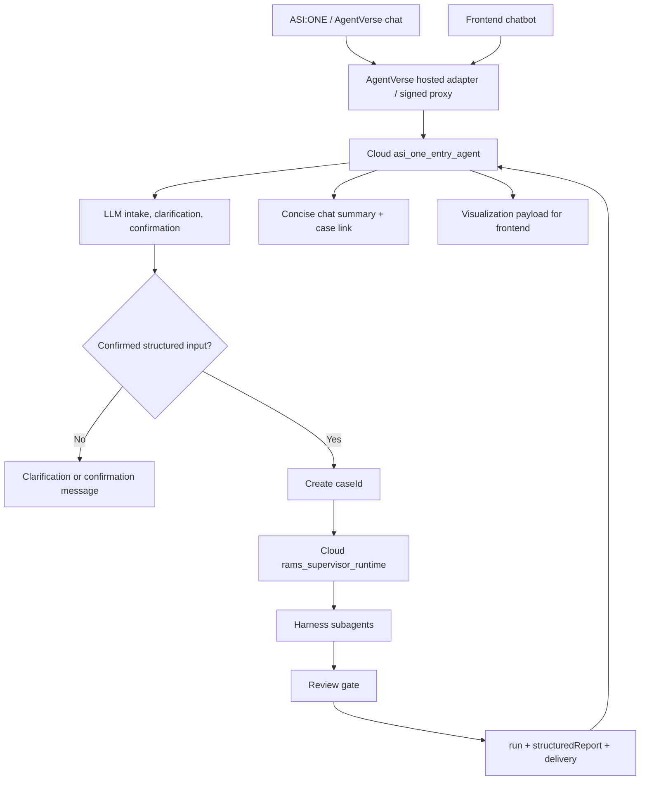

# ADR 0005: Unified LLM Intake And Case-Correlated Workflow

## Status

Accepted for implementation planning.

## Context

ADR 0004 established the AgentVerse entry-agent and AgentCore supervisor boundary. The current local frontend chatbot still uses a deterministic local ASI:ONE substitute for intake parsing, while the ASI:ONE proof-of-concept runtime uses a Bedrock/Strands model connection.

This creates a split product behavior:

- ASI:ONE messages can use an LLM-backed entry agent.
- Frontend chat messages can still be interpreted by local keyword parsing.
- The supervisor receives a request, but there is no stable case identifier generated at the moment the user confirms the structured input.

For the next cloud workflow, the team wants ASI:ONE and the frontend chatbot to behave the same way. Both should use the same LLM-backed intake contract, produce the same confirmed structured input, generate a shared identifier before supervisor launch, and let the supervisor organize all trace, report, and visualization work around that identifier.

The user experience should also work in chat surfaces. After launch or completion, the entry agent should not only provide a report link. It should also send a concise chat-appropriate summary with the safety boundary and priority checks.

## Decision

Use the cloud `asi_one_entry_agent` as the single LLM-backed intake and launch coordinator for both ASI:ONE and the frontend chatbot.

The entry agent must:

- interpret natural-language user messages with the Bedrock/Strands model path;
- ask clarifying questions when required fields are missing;
- generate a confirmation summary from structured intake;
- create a stable `caseId` when the user confirms the structured input;
- launch the AgentCore supervisor with both `caseId` and the confirmed structured input;
- return a concise chat delivery summary plus a case/report link;
- return the full supervisor payload when the caller is the frontend or another visualization-capable client.

The deterministic local ASI:ONE substitute may remain for explicit local tests and debugging, but it must not be the default product/demo path.

## Workflow



## Confirmed Input Contract

The entry agent owns this contract. The frontend and AgentVerse adapter should send raw user messages and metadata, not construct this payload themselves.

```json
{
  "caseId": "case_<generated-by-entry-agent>",
  "conversationId": "conversation-or-session-id",
  "entryAgentId": "@3d-rams",
  "confirmedByUser": true,
  "intake": {
    "locationText": "8 Albert Embankment",
    "locationCandidate": {
      "label": "8 Albert Embankment",
      "lat": 51.492099,
      "lng": -0.118712,
      "confidence": 0.85
    },
    "areaScope": {
      "type": "radius",
      "meters": 2000
    },
    "userGoal": "survey pre-visit review",
    "userNotes": "Visit tomorrow.",
    "materials": []
  },
  "runtimeOptions": {
    "useBedrock": true,
    "includePlanningFixture": true,
    "simulateMapFailure": false
  }
}
```

The entry agent must not launch the supervisor until the validated structured input contains:

- `confirmedByUser: true`;
- `caseId`;
- location text or a normalized coordinate candidate;
- area scope;
- user goal;
- safe notes/material metadata only.

## Supervisor Correlation Contract

The supervisor input must preserve `caseId` as the workflow correlation identifier.

```json
{
  "input": {
    "caseId": "case_<generated-by-entry-agent>",
    "siteName": "8 Albert Embankment",
    "latitude": 51.492099,
    "longitude": -0.118712,
    "goal": "survey pre-visit review",
    "additionalRequest": "Visit tomorrow.",
    "agentcoreUpstream": {
      "source": "ASI_ONE_OR_FRONTEND",
      "conversationId": "conversation-or-session-id",
      "entryAgentId": "@3d-rams",
      "caseId": "case_<generated-by-entry-agent>"
    }
  }
}
```

The supervisor output must echo `caseId` in:

- `output.caseId`;
- `output.structuredReport.caseId`;
- `output.run.caseId`;
- `output.run.request.caseId`;
- relevant trace/runtime metadata where useful for CloudWatch correlation.

## Delivery Contract

The entry agent should return two layers of output.

Chat-appropriate delivery:

- `caseId`;
- concise status;
- one short summary paragraph;
- 3 to 5 priority checks;
- safety/human-review reminder;
- case link, for example `/case/{caseId}` or the configured public frontend base URL.

Visualization-capable delivery:

- `caseId`;
- `delivery`;
- `structuredReport`;
- `run`;
- `subagentPlan`;
- `trace`;
- `safety`;
- any existing frontend visualization payload.

ASI:ONE can show the concise summary and link in chat. The frontend can show the same summary in the chatbot and render the full payload directly when it receives it.

## Implementation Plan

1. Add an LLM intake coordinator in `app/asi_one_entry_agent`.
   - Reuse the existing Bedrock/Strands model loading path.
   - Return strict JSON for clarification, confirmation, or launch-ready output.
   - Validate model output before any supervisor invocation.
   - Keep deterministic local intake only behind an explicit local/test path.

2. Update `app/asi_one_entry_agent/main.py`.
   - Accept frontend-style and AgentVerse-style chat payloads.
   - Normalize both into the same entry turn input.
   - When confirmed, generate `caseId`.
   - Call the supervisor runtime through `RAMS_SUPERVISOR_RUNTIME_ARN`.
   - Return concise chat delivery plus full payload when available.

3. Update `app/asi_one_entry_agent/supervisor_adapter.py`.
   - Require and forward `caseId`.
   - Preserve upstream metadata for ASI:ONE and frontend callers.
   - Build delivery payloads that include `caseId`, chat summary, and case link.

4. Update the frontend chatbot.
   - Stop sending `localAsiOne: true` on the default path.
   - Send raw message, conversation id, materials metadata, runtime options, and caller type to the signed proxy.
   - Render clarification, confirmation, concise chat summary, and full visualization payload from the unified entry response.
   - Keep local substitute only behind an explicit local/dev flag.

5. Update `agentverse/hosted_adapter.py`.
   - Preserve sender/conversation identity.
   - Send raw chat messages to the cloud entry runtime in the same entry turn shape as the frontend.
   - Continue using SigV4 signing and environment-only runtime ARN configuration.

6. Update supervisor runtime/report assembly.
   - Accept and echo `caseId`.
   - Include `caseId` in structured report and run output.
   - Keep Harness subagent execution behind `RAMS_SUBAGENT_EXECUTION_MODE=agentcore_harness` for cloud mode.

## Tests

Required tests before merge:

- LLM intake coordinator with fake model output:
  - missing location asks clarification;
  - `8 Albert Embankment tomorrow survey 2km` produces confirmation-ready structure;
  - user confirmation creates `caseId` and supervisor invocation;
  - invalid model JSON does not launch supervisor.
- Adapter tests:
  - frontend-style and AgentVerse-style payloads normalize into the same entry turn contract;
  - `caseId` is forwarded into supervisor input and delivery output;
  - concise chat summary includes priority checks, safety reminder, and case link.
- Supervisor tests:
  - `caseId` is echoed in `output`, `run`, and `structuredReport`;
  - cloud-mode fake Harness path does not add `localAsiOneSubstitute: true`.
- Frontend tests or focused build verification:
  - default chatbot payload does not include `localAsiOne: true`;
  - frontend can render clarification, confirmation, and final report payload.

## Consequences

Positive:

- ASI:ONE and frontend chat share the same intake and launch semantics.
- `caseId` becomes the stable correlation id for chat, supervisor trace, report output, links, and later storage.
- The chatbot can provide useful immediate output even when the full report is opened in a separate page.
- The deterministic local substitute can remain as a test fallback without defining product behavior.

Tradeoffs:

- Entry-agent tests need fake model responses to remain deterministic.
- The entry agent becomes responsible for structured intake validation and id generation.
- A later report store can be added behind the same `caseId`, but this ADR does not require persistent storage for the first implementation.

## Public Repo Boundary

Do not commit real AWS account ids, AgentCore runtime ARNs, Harness ARNs, IAM access keys, AgentVerse keys, seed phrases, private notes, or client data. Use environment variable names and placeholders only.
