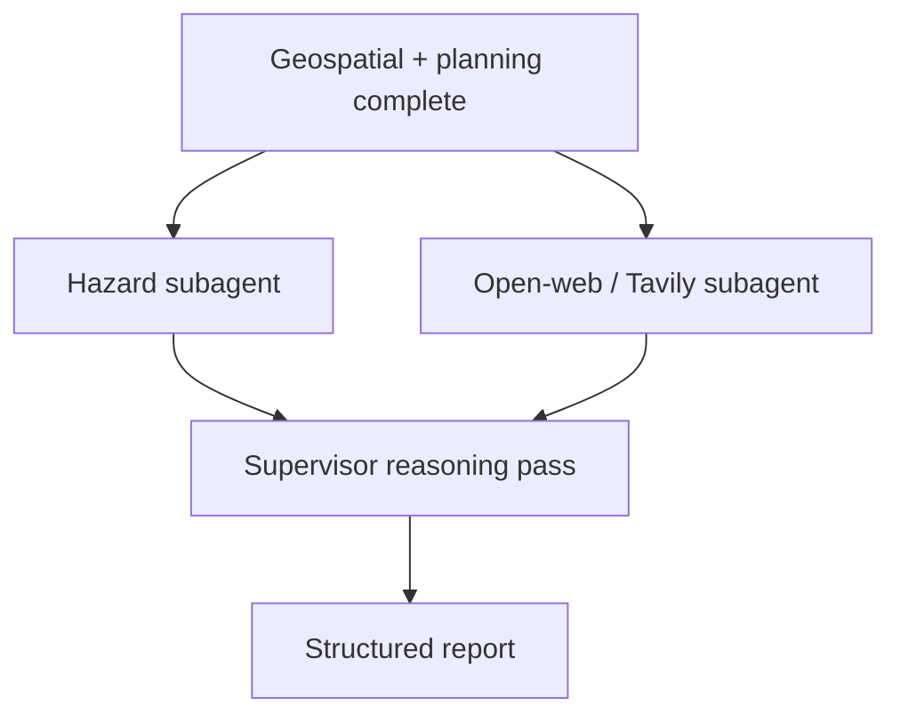

# ADR 0010: Tavily Open-Web Signals Subagent

## Status

Proposed for implementation planning.

## Context

ADR 0002 includes Tavily-backed web search for news, posts, and other public signals related to the confirmed site. The current AgentCore runtime intentionally omits open-web work. The supervisor Harness subagent plan notes that open-web/Tavily work is omitted until credential handling and source-boundary decisions are explicit.

The structured report schema already reserves `externalSignals.openWeb`, and the current data-quality object already records `hasOpenWebSignals: false`. This gives the project a clean insertion point.

Open-web results are materially different from current fixture and professional-context sources. They may be stale, noisy, duplicated, promotional, speculative, or irrelevant. They should be treated as signals for human review, not authoritative evidence for professional RAMS, planning, legal, emergency, or approval-to-work conclusions.

## Decision

Add a dedicated open-web specialist subagent backed by Tavily, exposed as a separate AgentCore Harness:

- `app/rams_open_web_harness/`;
- tool group `open_web_subagent`;
- tool function `search_open_web_signals`;
- tool schema `app/rams_agent_tools/tool_schemas/search_open_web_signals.json`;
- optional live execution controlled by environment variables.

The supervisor should call this subagent only after the site has been resolved, because the search query needs the normalized site label, location text, authority, and area context. It does not need hazard extraction to finish, so it can run in parallel with hazard extraction after geospatial and planning subagents complete.

## Workflow Position



## Source Boundary

Open-web findings must be labeled as `signal`, not `evidence`, unless a later source-specific policy promotes a particular source class.

The open-web subagent must return:

- source URL;
- title;
- snippet or short summary;
- published date when available;
- retrieval date;
- source type when inferable, such as `news`, `social`, `blog`, `official`, `unknown`;
- relevance score or label;
- confidence label;
- reason for inclusion;
- warning flags such as stale, duplicate, promotional, unverified, or weakly related.

It must not:

- scrape or store private content;
- treat posts or news as authoritative technical evidence;
- generate professional conclusions from web signals alone;
- emit secrets, private user data, or credentials.

## Tool Contract

Input:

```json
{
  "location": {
    "label": "8 Albert Embankment and land to the rear",
    "latitude": 51.492099,
    "longitude": -0.118712,
    "authority": "London Borough of Lambeth"
  },
  "request": {
    "goal": "survey pre-visit review",
    "additionalRequest": "Visit tomorrow."
  },
  "areaScope": {
    "type": "radius",
    "meters": 2000
  },
  "maxResults": 5
}
```

Output:

```json
{
  "openWeb": {
    "status": "not_configured | disabled | ok | partial | error",
    "provider": "tavily",
    "query": "8 Albert Embankment Lambeth survey access flood planning",
    "retrievedAt": "2026-06-30T00:00:00Z",
    "items": [
      {
        "id": "web-signal-1",
        "title": "Example public result",
        "url": "https://example.com/article",
        "sourceType": "news",
        "publishedAt": "2026-06-20",
        "snippet": "Short source-backed snippet.",
        "relevance": "medium",
        "confidence": "low",
        "reasonForInclusion": "Mentions the site area and public interface constraints.",
        "flags": ["unverified-open-web-signal"]
      }
    ],
    "warnings": []
  },
  "trace": []
}
```

## Configuration

Recommended environment variables:

```bash
ENABLE_TAVILY=false
TAVILY_API_KEY=
TAVILY_MAX_RESULTS=5
TAVILY_TIMEOUT_SECONDS=20
TAVILY_SEARCH_DEPTH=basic
```

When `ENABLE_TAVILY` is not true or no key is available, the subagent must return a clear disabled/not-configured payload rather than failing the whole supervisor workflow.

## Implementation Guidance

First implementation:

1. Add the shared tool function in `rams_agent_tools.tools.open_web`.
2. Add deterministic disabled and fixture/mock behavior so local tests remain stable.
3. Add `rams_open_web_harness` with only the open-web tool allowed.
4. Register `open_web_subagent` in `SUPERVISOR_HARNESS_SUBAGENTS`.
5. Add the Harness to `agentcore/agentcore.json` after CLI scaffold/add-harness flow is used or manually mirror the established Harness shape if CLI is unavailable.
6. Extend `SubagentInvoker` with `invoke_open_web`.
7. Dispatch open-web in parallel with hazard extraction after initial geospatial/planning outputs.
8. Merge output into `run.externalSignals.openWeb` and `structuredReport.externalSignals.openWeb`.
9. Update `dataQuality.completeness.hasOpenWebSignals`.
10. Add tests for disabled mode, fixture/mock mode, and no secrets in output.

## Non-Goals

- Do not make Tavily required for local Demo1.
- Do not make open-web signals authoritative professional evidence.
- Do not implement broad crawling or private content ingestion.
- Do not commit API keys or live result caches containing private/user-specific data.

## Consequences

Positive:

- Adds public-signal awareness without blocking the core fixture workflow.
- Keeps noisy web data isolated behind a specialist subagent and source boundary.
- Gives the reasoning pass more context while preserving confidence labels.

Tradeoffs:

- Requires new credential handling and rate-limit behavior.
- Adds nondeterminism in live mode.
- Requires careful UI labeling so web results are not mistaken for verified professional evidence.

## Acceptance Criteria

- Open-web subagent can be disabled without failing the workflow.
- Live Tavily mode is controlled only by environment variables.
- Structured report includes `externalSignals.openWeb`.
- `dataQuality.completeness.hasOpenWebSignals` reflects whether usable signals were returned.
- Open-web items are labeled as signals with URLs, dates where available, confidence, and flags.
- No secrets, private content, or unsupported professional claims are emitted.
