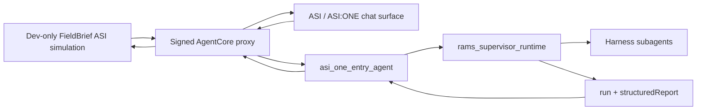

# ADR 0012: AgentCore Hosted Product API Surface

## Status

Accepted direction from discussion.

## Context

`main` added a hosted FastAPI product API around the pre-visit agent:

- `/health`;
- `/api/run`;
- `/api/session/start`;
- `/api/upload-url`;
- `/api/chat`;
- `/api/session/{session_id}`.

`dev-chunteng` moved the product path into the standard AgentCore shape:

- `app/asi_one_entry_agent` owns intake, clarification, confirmation, and supervisor launch;
- `app/rams_supervisor_runtime` owns orchestration, Harness subagents, structured report output, and report lookup;
- `agentverse/frontend_proxy.py` and `agentverse/frontend_proxy_lambda.py` expose a signed proxy to the AgentCore entry runtime;
- the frontend calls `VITE_CLOUD_ENTRY_PROXY_URL` instead of the old hosted FastAPI API.

The core chat/intake behavior from `main` has been migrated and upgraded, but the exact hosted FastAPI API surface has not. Reintroducing the old `backend/` service would duplicate orchestration ownership and weaken the AgentCore boundary.

The product direction is simpler: the user interface should present only an ASI/ASI:ONE-style entry path. The current FieldBrief Agent entry in the frontend is a development/debug-only simulation of that ASI/ASI:ONE entry experience, not a separate product API. The lower-level integration should use AgentCore-style runtime invocation contracts throughout, not FastAPI-style route contracts.

This ADR is parallel to ADR 0013, ADR 0014, ADR 0015, and ADR 0016. It decides only the HTTP product surface boundary. It does not decide ASI/ASI:ONE identity-bound report access, upload storage, session persistence, or deployment mechanics.

## Decision

Do not restore the old `backend/` FastAPI service or its `/api/*` product route model.

The interface should expose one ASI/ASI:ONE-style conversational entry. In local development and debugging, the FieldBrief Agent UI may simulate that entry point. In cloud mode, ASI/ASI:ONE should call the AgentCore entry runtime through the signed proxy using the same entry-turn contract.

The lower-level API contract should be AgentCore-native:

- frontend or ASI/ASI:ONE-style caller sends an entry turn;
- `asi_one_entry_agent` owns clarification, confirmation, and launch coordination;
- `rams_supervisor_runtime` owns orchestration, Harness subagents, report generation, and report lookup;
- the proxy signs and forwards AgentCore runtime invocations, but does not define product-specific FastAPI semantics.

Compatibility with Evan's `/api/chat`, `/api/run`, `/api/session/start`, or `/api/upload-url` routes is intentionally not a goal. Any future browser-facing helper must be described as an AgentCore invocation adapter, not a FastAPI product backend.

The authoritative product workflow remains:

## Options Considered

1. Restore `backend/` FastAPI unchanged.
   - Pros: fastest way to regain Evan's API shape.
   - Cons: creates a second orchestration stack outside AgentCore and duplicates chat/intake logic.

2. Add product-friendly `/api/*` compatibility routes as thin wrappers.
   - Pros: easier compatibility with Evan's hosted MVP scripts and UI language.
   - Cons: preserves the FastAPI mental model and creates confusion about the real integration boundary.

3. Use only the ASI/ASI:ONE-style AgentCore entry contract.
   - Pros: one interface story, one orchestration boundary, and no duplicate backend route model.
   - Cons: Evan's FastAPI route-level smoke checks need to be rewritten as AgentCore invocation checks.

## Consequences

Positive:

- The AgentCore entry agent remains the only owner of intake semantics.
- The supervisor remains the only owner of orchestration and report assembly.
- The frontend behaves like a development/debug ASI/ASI:ONE entry simulation instead of a separate product backend.
- Hosted and local demos tell the same architecture story.

Tradeoffs:

- Evan's hosted FastAPI route names are not preserved.
- Hosted smoke tests must validate AgentCore entry invocations rather than `/api/*` routes.
- Any future helper proxy must stay transport-level and avoid product orchestration logic.

## Acceptance Criteria

- ASI/ASI:ONE-style callers can reach the cloud `asi_one_entry_agent` through one documented AgentCore invocation path.
- The FieldBrief Agent frontend is documented as a local development/debug simulation of the ASI/ASI:ONE entry path, not the production user entry.
- No route or helper bypasses `asi_one_entry_agent` for intake or `rams_supervisor_runtime` for report generation.
- The codebase does not reintroduce `backend/` FastAPI as a product runtime.
- The no-AWS local path still runs without cloud credentials.
- Public docs do not claim certified RAMS, emergency guidance, legal approval, or approval to work.

## Discussion Questions

- What should the frontend label be: `FieldBrief Agent`, `ASI FieldBrief`, or a more explicit `ASI entry simulation`?
- Should the local FieldBrief simulation require the same confirmation flow as cloud ASI/ASI:ONE, even when running deterministic no-AWS mode?
- Which existing docs still imply a FastAPI product backend and need cleanup?
