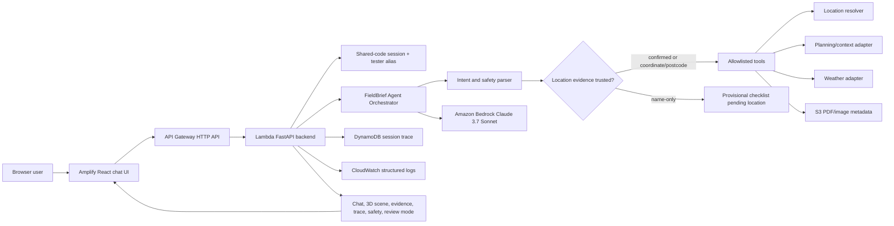
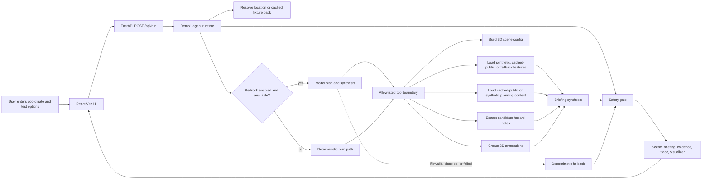
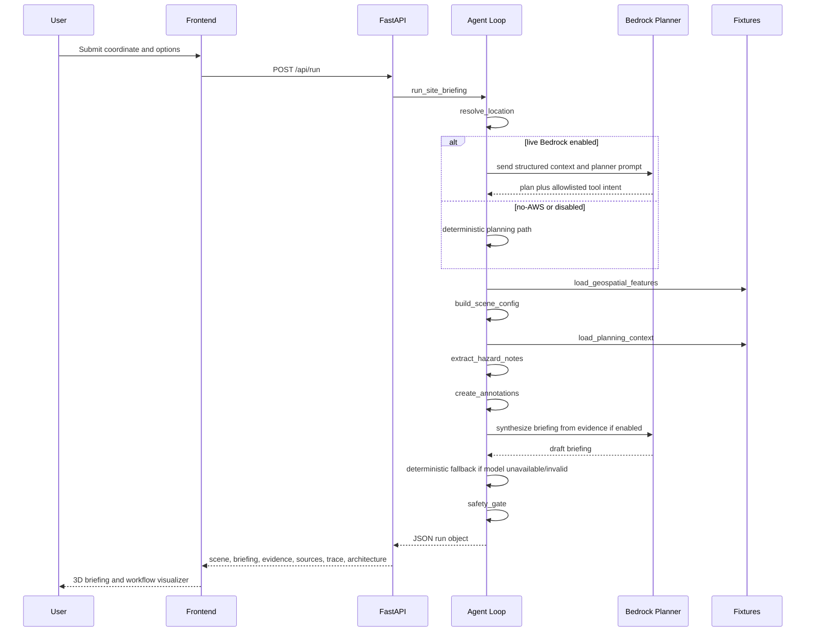
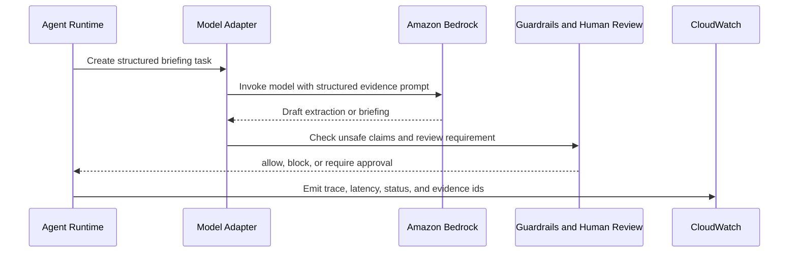
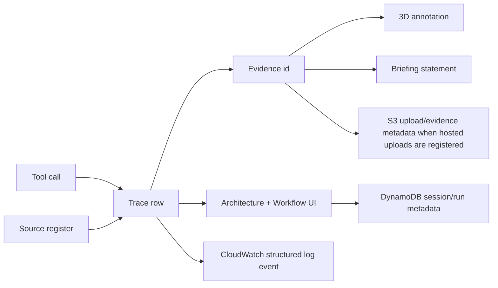
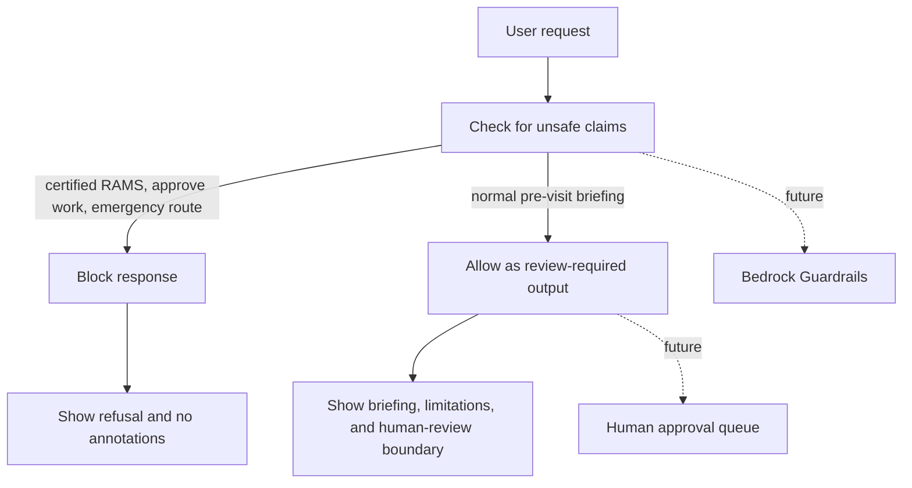
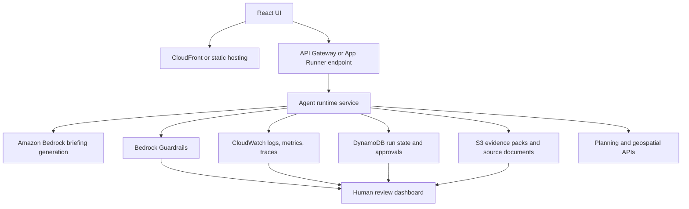

# 3D-RAMS Architecture

This document is the public, living architecture reference for the 3D-RAMS hosted pre-visit agent. It explains what the agent does today, what is mocked, what is real, and how the run shape maps to AWS.

3D-RAMS creates a pre-visit briefing pack for human review. It does not create certified RAMS, emergency guidance, approval to work, or a competent-person replacement.

## Runtime Modes

The milestone now has four public-safe runtime interpretations:

- `Current hosted Bedrock planner`: access-code gated hosted path where Lambda calls Bedrock server-side. The model plans/synthesizes, but tools, evidence, and safety remain explicit and inspectable.
- `AgentCore-ready conversation runtime`: selected rebuild path. The current implementation keeps Lambda/FastAPI as the active adapter while adding bounded session memory, a guards-first conversation router, and an AgentCore integration boundary.
- `Current no-AWS fallback`: deterministic local path when Bedrock is disabled, unavailable, rejected by safety, or fails.
- `Hosted product path`: browser user opens a hosted URL, starts a shared-code test session, chats with the pre-visit agent, and receives chat, 3D scene, evidence, trace, confidence, and safety output.
- `Future AWS services`: managed AgentCore Runtime/Memory activation, Cognito, Bedrock Guardrails, AgentCore Observability, CloudWatch dashboards, API throttling/WAF, and richer live data adapters are production-shaped follow-on stages, not current MVP claims.

## Hosted Chat-To-Brief Flow

## AgentCore-Ready Conversation And Memory Boundary

The active hosted route keeps a thin Lambda/FastAPI adapter in front of the agent so access-code checks, CORS, upload presigns, and response shaping stay outside the model path. The selected rebuild path is AgentCore-compatible: the router, memory contract, tool loop, evaluator, and safety gate are explicit boundaries that can move behind AgentCore Runtime after the AWS feasibility gate passes.

```mermaid
flowchart LR
    User["Browser user"] --> UI["Hosted React chat UI"]
    UI --> APIGW["API Gateway"]
    APIGW --> Lambda["Lambda / FastAPI adapter"]

    Lambda --> Guards["Deterministic guards: auth, safety, location gate, budgets"]
    Guards --> Router{"Conversation router"}

    subgraph Memory["Bounded session memory"]
        Turns["Recent turns"]
        Working["Working memory: active run, pending action, confirmed site"]
        Trace["Trace/evidence summary"]
    end

    subgraph AgentCoreTarget["AgentCore runtime boundary - selected path"]
        Planner["Planner"]
        ToolLoop["Allowlisted tool loop"]
        Reasoner["Risk reasoner"]
        Evaluator{"Evaluator / repair loop <= 3"}
        Compiler["Review-pack compiler"]
        Safety["Final safety gate"]
    end

    Router -->|"follow-up/status"| Memory
    Memory -->|"context answer"| UI
    Router -->|"new site task"| Planner
    Planner --> ToolLoop --> Reasoner --> Compiler --> Evaluator
    Evaluator -->|"repair needed"| ToolLoop
    Evaluator -->|"pass or stop"| Safety
    Safety --> UIState["Chat, map, risks, evidence, trace, safety"]
    UIState --> UI
```

## Compatibility Query-To-Brief Flow

## Data Flow And Trust Boundaries

## Current Tool-Calling Sequence

## Bedrock Briefing Path

The hosted MVP runs Bedrock server-side through Lambda when access-code validation succeeds. Local and CI modes can still run without Bedrock, and deterministic briefing remains the fallback. The hosted planner/synthesis path is capped at 2 model calls per run. The default UI uses the cached `public-lambeth-thames` pack anchored on 8 Albert Embankment. Live-map MVP mode can call Planning Data and OSM/Overpass server-side after location confirmation; Google Maps/Earth and broad live planning-portal scraping remain out of scope.

V3.1 adds a pre-tool intent and location-evidence gate. The parser extracts clean site label, coordinate, postcode/outcode, nearest-town clue, site/activity type, visit date, and unsafe certification/approval intent. The resolver is fixture-first plus server-side Postcodes.io for postcode/outcode clues. Broad site-name web geocoding is deferred; the system must not ask the LLM to invent coordinates. Name-only random sites can show a clearly labelled provisional checklist, but site-specific scene/evidence/briefing output requires confirmed location evidence.

## LLM-First Control Surface

The frontend now explains the run in this order:

1. model plan;
2. allowlisted tool calls;
3. tool results and evidence;
4. synthesis;
5. safety gate;
6. deterministic fallback.

The UI is intentionally defensive. If backend fields such as `agentMode`, `llmPlan`, `llmToolCalls`, `modelCalls`, `tokenUsage`, or `fallback` are absent, the visualizer falls back to `runtime` and `trace` data instead of breaking.

## Evidence, Trace, And Observability Flow

Each backend tool emits a compact trace object:

- `id`, `name`, `type`, `status`, `summary`;
- `startedAt`, `endedAt`, `durationMs`;
- `sourceIds`, `evidenceIds`, `fallbackReason`;
- `awsMapping`;
- `output`.

## Safety And Human Review Gate

The safety gate is deliberately visible. Judges and teammates should be able to see where the agent refuses high-risk claims and where a human review point would sit in production.

## Real Vs Mocked Register

| Area | Current Source | Current Status | Visible In UI | Production AWS Mapping | Upgrade Risk |
| --- | --- | --- | --- | --- | --- |
| Agent loop | Python backend | Real deterministic code plus optional Bedrock planner/synthesis | Tool timeline, LLM-first explainer, and trace | Bedrock model/tool planning | Model variability and evaluation |
| Public fixture pack | `fixtures/public-lambeth-thames` | Cached public-source metadata and attribution files | Source register, evidence, trace, briefing | S3 source pack plus source registry | Source freshness, licence handling, and overclaiming |
| Request state | Browser form payload | Real | Run overview | DynamoDB run/session record | Data privacy and retention |
| 3D viewer | React/Vite + CesiumJS | Real Cesium terrain/imagery/buildings when `VITE_CESIUM_ION_TOKEN` is configured; labelled synthetic fallback otherwise | 3D scene | Static frontend plus API runtime | Performance, token URL restrictions, and provider availability |
| Geospatial features | Live Planning Data + OSM/Overpass when enabled; synthetic/cached fallback otherwise | Live public, cached-public, mocked, or fallback | Sources, live feature layers, and annotations | Lambda/FastAPI live adapters plus S3 fallback source packs | Licensing, freshness, rate limits, key management |
| Planning context | Synthetic fixture or cached public pack | Synthetic, cached-public, or unavailable | Sources, evidence, briefing limits | S3 documents plus Bedrock extraction | Scraping reliability and citations |
| Bedrock planner/synthesis | Amazon Bedrock through Lambda in hosted mode | Live hosted MVP call with deterministic fallback | Runtime mode, LLM-first panel, trace, and briefing | Evaluated Bedrock adapter with CloudWatch traces | Cost, model access, latency, and fallback quality |
| Safety gate | Python rules | Real Demo1 policy | Safety pill and visualizer | Guardrails plus human review queue | Overclaiming or hidden unsafe edge cases |
| Evidence register | API response plus hosted upload metadata | Real response object; S3 presigned upload path in hosted mode | Evidence cards | S3 evidence pack | Source traceability |
| Observability | JSON trace plus CloudWatch structured logs | Real response object and hosted log events | Trace and visualizer | CloudWatch dashboards, metrics, and traces later | Noise and cost control |

## Future Risk Intelligence Sources

These sources are not live in Demo1. They are future review-pack inputs that should use the same source-register, evidence, confidence, and fallback pattern before any live API is added.

| Source Group | Example Use | Demo1 Status | Main Risk |
| --- | --- | --- | --- |
| Infrastructure and grid context | Overhead lines, pylons, substations, route constraints, and other open infrastructure risks. | Future only | Licensing, coverage, critical-asset sensitivity, and false positives. |
| Weather and seasonal context | Combine slope, access, flood, wind, snow/ice, rain, quarry or ground-risk context into review flags. | Future only | Forecast uncertainty, stale data, and operational-advice overclaiming. |
| News and live incidents | Nearby transport crashes, road closures, industrial incidents, flood warnings, or major disruption. | Future only | Freshness, geocoding accuracy, misinformation, and emergency-guidance risk. |

Future reasoning should produce inspectable review flags, not unsupported instructions. Example shape: source combination, confidence, evidence ids, risk flag, and human review requirement.

## AWS Production Path

## Visualizer Contract

The `/api/run` response keeps the visualizer in the normal agent response. There is no separate visualizer endpoint.

Core fields:

- `request`: submitted site name, coordinate, goal, toggles, and additional request;
- `sources`: real, mocked, fallback, unavailable, and future source register;
- `runtime`: deterministic, Bedrock, disabled, fallback, and optional `agentMode` metadata;
- `llmPlan`: optional model plan summary or structured planner payload;
- `llmToolCalls`: optional allowlisted tool call records returned by the planner/runtime;
- `modelCalls`: optional model invocation records, latency, and token usage;
- `tokenUsage`: optional aggregate token counts for public runtime explanation;
- `fallback`: optional deterministic fallback reason and trigger;
- `trace`: ordered tool calls with source ids, evidence ids, fallback reason, model metadata, and AWS mapping;
- `evidence`: evidence register shown to the user;
- `safety`: allow/block decision, triggered rules, review requirement, and decision id;
- `architecture`: UI-ready run overview, current trace, source map, safety gate, real-vs-mocked register, hosted AWS mapping, and future AWS path.
