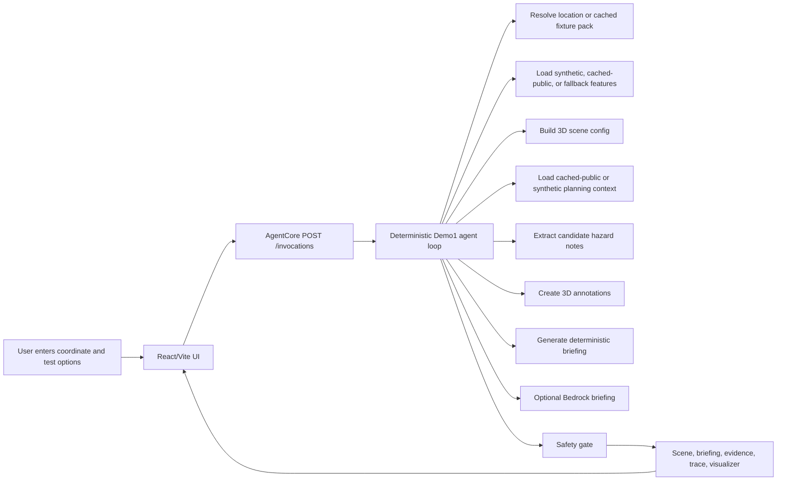
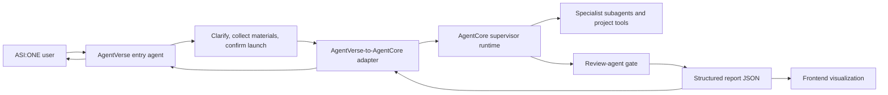
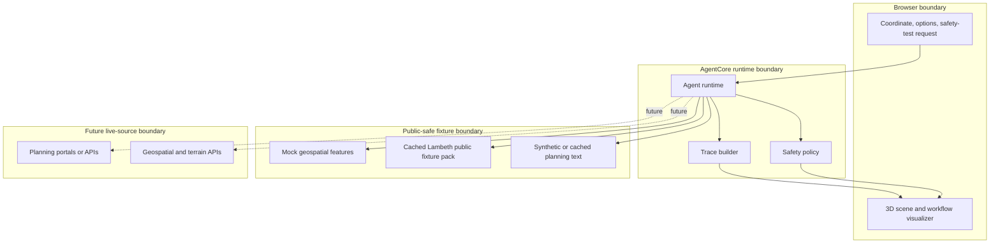
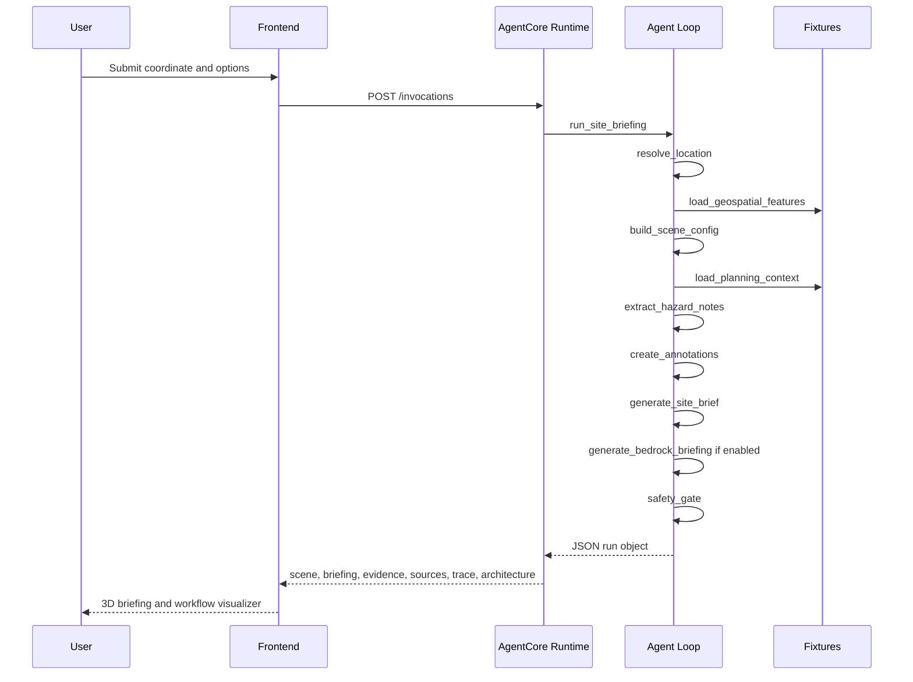
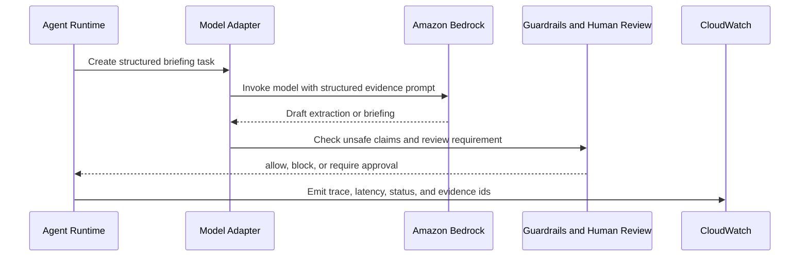
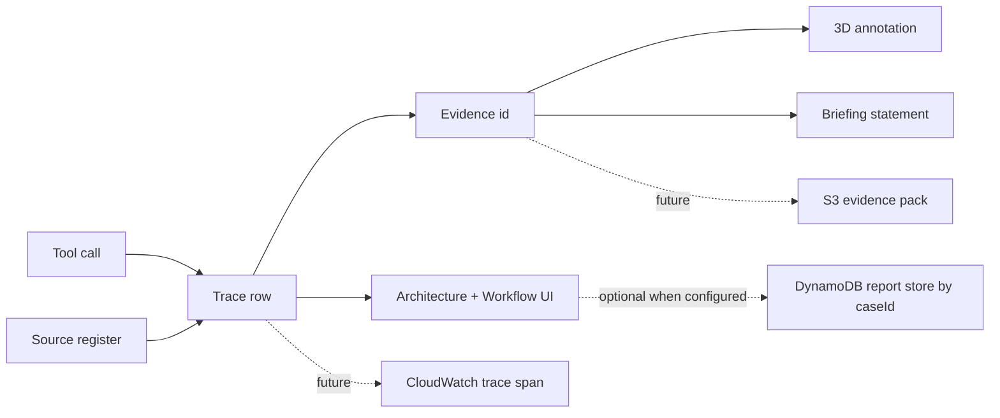
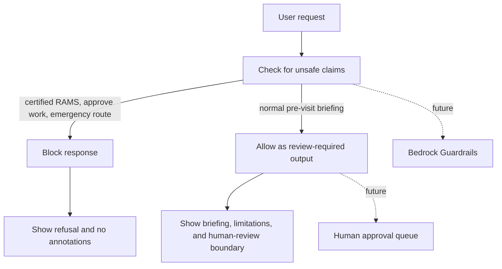
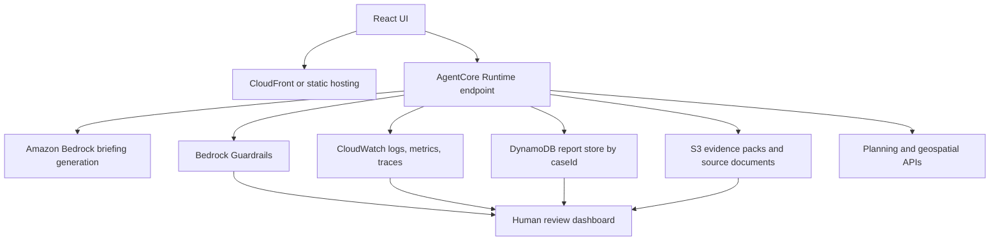

# 3D-RAMS Architecture

This document is the public, living architecture reference for Demo1. It explains what the agent does today, what is mocked, what is real, and how the same run shape can map to AWS later.

3D-RAMS creates a pre-visit briefing pack for human review. It does not create certified RAMS, emergency guidance, approval to work, or a competent-person replacement.

## Query-To-Brief Flow

## AgentVerse Entry And AgentCore Supervisor Boundary

The adapter exists only at the AgentVerse-to-AgentCore boundary. It handles launch-readiness validation, request mapping, and future IAM/signing. Supervisor planning, specialist subagents, tool calls, reasoning, report assembly, and review loops belong inside AgentCore.

## Data Flow And Trust Boundaries

## Current Tool-Calling Sequence

## Bedrock Briefing Path

Demo1 can run without Bedrock, but it now has a live Bedrock briefing path when `ENABLE_BEDROCK=true`. The deterministic briefing remains the fallback, and the Bedrock step is limited to one model call per agent run. The default UI uses the cached `public-lambeth-thames` pack anchored on 8 Albert Embankment. Runtime does not call live Planning Data, OpenStreetMap, Environment Agency, Lambeth, TfL, Google, or OS services.

## Evidence, Trace, And Observability Flow

Each runtime tool emits a compact trace object:

- `id`, `name`, `type`, `status`, `summary`;
- `startedAt`, `endedAt`, `durationMs`;
- `sourceIds`, `evidenceIds`, `fallbackReason`;
- `awsMapping`;
- `output`.

## Safety And Human Review Gate

The safety gate is deliberately visible. Judges and teammates should be able to see where the agent refuses high-risk claims and where a human review point would sit in production.

## Real Vs Mocked Register

| Area | Current Source | Current Status | Visible In UI | Production AWS Mapping | Upgrade Risk |
| --- | --- | --- | --- | --- | --- |
| Agent loop | AgentCore Python runtime | Real deterministic code plus optional Bedrock briefing | Tool timeline and trace | Bedrock model/tool planning | Model variability and evaluation |
| Public fixture pack | `fixtures/public-lambeth-thames` | Cached public-source metadata and attribution files | Source register, evidence, trace, briefing | S3 source pack plus source registry | Source freshness, licence handling, and overclaiming |
| Request state | Browser form payload plus optional `caseId` report-store item | Real; DynamoDB write only when configured | Run overview | DynamoDB report metadata keyed by `caseId` | Data privacy and retention |
| 3D viewer | React/Vite + CesiumJS | Real token-free local scene plus overlay | 3D scene | Static frontend plus API runtime | Performance on low-power devices |
| Geospatial features | Synthetic fixture or cached public pack | Mocked, cached-public, or fallback | Sources and annotations | S3 source object plus live geospatial APIs | Licensing, freshness, key management |
| Planning context | Synthetic fixture or cached public pack | Synthetic, cached-public, or unavailable | Sources, evidence, briefing limits | S3 documents plus Bedrock extraction | Scraping reliability and citations |
| Bedrock briefing | Amazon Bedrock when configured | Optional live AWS call with deterministic fallback | Runtime mode, trace, and briefing | Evaluated Bedrock adapter with CloudWatch traces | Cost, model access, latency, and fallback quality |
| Safety gate | Python rules | Real Demo1 policy | Safety pill and visualizer | Guardrails plus human review queue | Overclaiming or hidden unsafe edge cases |
| Evidence register | API response | Real response object | Evidence cards | S3 evidence pack | Source traceability |
| Observability | JSON trace | Real response object | Trace and visualizer | CloudWatch logs, metrics, traces | Noise and cost control |

## Future Risk Intelligence Sources

These sources are not live in Demo1. They are future review-pack inputs that should use the same source-register, evidence, confidence, and fallback pattern before any live API is added.

| Source Group | Example Use | Demo1 Status | Main Risk |
| --- | --- | --- | --- |
| Infrastructure and grid context | Overhead lines, pylons, substations, route constraints, and other open infrastructure risks. | Future only | Licensing, coverage, critical-asset sensitivity, and false positives. |
| Weather and seasonal context | Combine slope, access, flood, wind, snow/ice, rain, quarry or ground-risk context into review flags. | Future only | Forecast uncertainty, stale data, and operational-advice overclaiming. |
| News and live incidents | Nearby transport crashes, road closures, industrial incidents, flood warnings, or major disruption. | Future only | Freshness, geocoding accuracy, misinformation, and emergency-guidance risk. |

Future reasoning should produce inspectable review flags, not unsupported instructions. Example shape: source combination, confidence, evidence ids, risk flag, and human review requirement.

## AWS Production Path

## Visualizer Contract

The `/invocations` response keeps the visualizer in `output.run`. There is no separate visualizer endpoint.

Core fields:

- `request`: submitted site name, coordinate, goal, toggles, and additional request;
- `sources`: real, mocked, fallback, unavailable, and future source register;
- `runtime`: deterministic, Bedrock, disabled, or fallback briefing mode;
- `trace`: ordered tool calls with source ids, evidence ids, fallback reason, model metadata, and AWS mapping;
- `evidence`: evidence register shown to the user;
- `safety`: allow/block decision, triggered rules, review requirement, and decision id;
- `architecture`: UI-ready run overview, current trace, source map, safety gate, real-vs-mocked register, and future AWS path.
