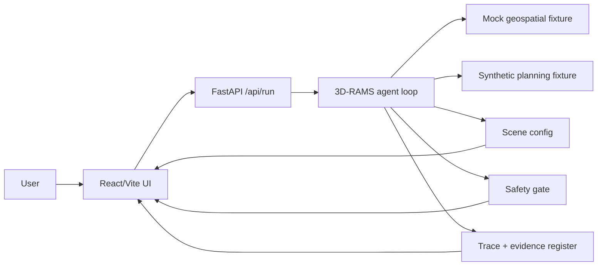
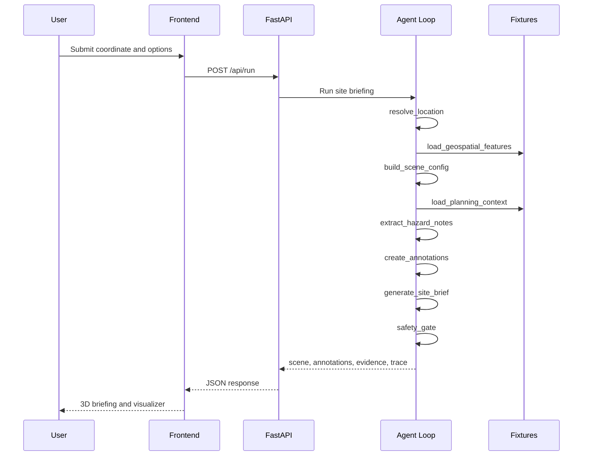
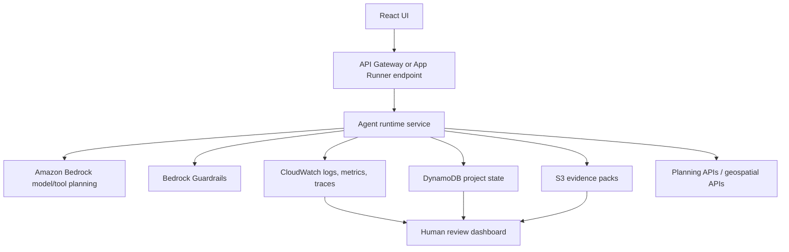

# 3D-RAMS Architecture

## Current Demo1 Boundaries

## Agent Tool Sequence

## AWS Production Path

## Trace Shape

Each backend tool emits:

- `name`: stable tool name;
- `status`: `ok`, `warning`, `fallback`, or `blocked`;
- `summary`: human-readable action summary;
- `timestamp`: UTC ISO timestamp;
- `output`: compact structured output.

This is deliberately close to a CloudWatch/AgentCore observability model: each tool call can become a span, each status can become a metric dimension, and each run can attach evidence IDs for audit.

## Real vs Mocked Register

| Area | Current | Upgrade Path |
| --- | --- | --- |
| Agent loop | Real deterministic Python | Add Bedrock model adapter behind `ENABLE_BEDROCK=true`. |
| Location resolution | Fixture | Add postcode/address geocoder or official gazetteer source. |
| Geospatial features | Fixture | Add OS, OSM, satellite, or sponsor geospatial APIs. |
| 3D map | Local Cesium scene | Add live terrain/tiles if licensing, key management, and reliability fit. |
| Planning context | Synthetic text fixture | Add LPA search, document retrieval, OCR, parsing, and cited extraction. |
| Safety gate | Rule-based | Add Guardrails and policy tests. |
| State | In-memory per request | Add DynamoDB versioned runs and approvals. |
| Evidence packs | JSON response | Add S3 export and signed review links. |
| Observability | JSON trace in UI | Add CloudWatch logs, metrics, traces, and run dashboards. |

