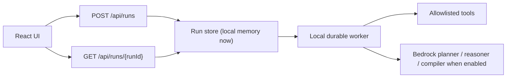
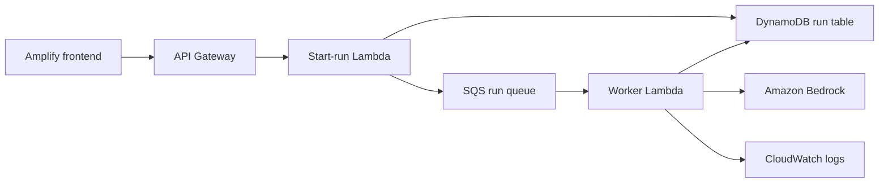

# Durable Runtime V3 Branch

This branch carries the current hosted V3 runtime shape for 3D-RAMS.

Branch:

```text
feature/durable-runs-tool-loop
```

## Goal

Move from a synchronous chat call toward a production-shaped agent runtime:

- create a `runId` immediately;
- persist run status and checkpoints;
- expose polling/reconnect through `GET /api/runs/{runId}`;
- pause named-site-only prompts for source-labelled location resolution and user confirmation;
- validate all model-requested tools against an allowlist;
- checkpoint after each major model/tool phase;
- keep cancellation, fallback, trace, and safety boundaries visible.

This is still a hackathon V3 runtime, not a production-ready system. It is deployed to the hosted teammate-test URL after review, but it must not be described as certified RAMS, emergency guidance, approval-to-work, or production-ready infrastructure.

## Gate 1 Architecture Decision

Chosen for this branch:



Future AWS deployment shape:



Rejected for Gate 1:

- **Long synchronous `/api/chat` only**: simple, but weak for reconnect, cancellation, and durable evidence.
- **Step Functions immediately**: strong for production orchestration, visual history, and retries, but higher deployment and state-machine overhead before the local run semantics are proven.
- **Direct async Lambda only**: quick, but hides queue/backpressure behavior compared with the future SQS worker path.

Current branch recommendation: use the hosted V3 path for teammate testing, then implement true durable run persistence with DynamoDB + SQS + worker Lambda only after review.

## API Shape

### `POST /api/runs`

Creates a durable run and returns immediately with the current run state.

Request:

```json
{
  "sessionId": "session-...",
  "message": "I want to visit 8 Albert Embankment tomorrow for a survey.",
  "uploadedFileIds": [],
  "useBedrock": true,
  "autoStart": true
}
```

Response includes:

- `runId`;
- `status`;
- `locationResolution` when the run is waiting for site confirmation;
- `currentStep`;
- `modelCallsUsed`;
- `maxModelCalls`;
- `tokenBudget`;
- `steps`;
- `toolResults`;
- `partialUiState`;
- `finalUiState` when complete;
- `safetyResult`;
- `fallbackReason`;
- `errorSummary`.

### `GET /api/runs/{runId}`

Returns the latest checkpointed run state. The frontend uses this for polling and refresh/reconnect.

### `POST /api/runs/{runId}/cancel`

Marks queued/running work as cancelled. The worker checks cancellation before major model/tool phases.

### `POST /api/runs/{runId}/confirm-location`

Confirms one source-labelled candidate returned by the location resolver. The review workflow does not start until this confirmation happens.

## Run Statuses

Supported statuses:

- `queued`
- `running`
- `waiting_for_clarification`
- `waiting_for_location_confirmation`
- `waiting_for_approval`
- `completed`
- `failed`
- `cancelled`

Unsafe requests complete with a blocked safety result rather than pretending to generate an operational pack.

## Tool Registry

V3 uses a registry where each tool declares:

- name;
- description;
- input/output schema;
- side-effect level;
- cost estimate;
- timeout;
- retry policy;
- cacheability;
- approval requirement;
- safety constraints.

Initial allowlist:

- `resolve_location`
- `load_geospatial_features`
- `build_scene_config`
- `load_planning_context`
- `extract_hazard_notes`
- `rank_risks`
- `create_annotations`
- `compile_review_pack`
- `safety_gate`

The LLM can request tool calls, but the backend executes only allowlisted tools. Unknown tool requests are rejected and fall back to the default sequence.

## Model Budget

The current live MVP remains configured for `2` calls/run. The V3 runtime supports a hard maximum of `3` calls/run when explicitly enabled:

| Phase | Purpose | Default output cap |
| --- | --- | --- |
| Planner | Understand request and select allowlisted tools | `900` |
| Reasoner | Rank risks and uncertainty from tool outputs | `1500` |
| Compiler | Produce final user-facing review pack | `2200` |

More calls are not automatically better. A third call is useful only if it materially improves risk ranking, uncertainty handling, or evidence-backed final wording.

Cost controls:

- temperature remains around `0.2`;
- model calls are counted per run;
- model-call budget is visible in the run status;
- output token caps are phase-specific;
- input-token cost still matters and should be reviewed from Bedrock usage metadata when live calls are used;
- current branch tests use mocked Bedrock metadata, so live provider token-usage capture remains a pre-deployment follow-up.

## Current Implementation

Implemented on this branch:

- local memory run store;
- `/api/runs`, `/api/runs/{runId}`, `/api/runs/{runId}/confirm-location`, `/api/runs/{runId}/cancel`;
- checkpointed durable runner;
- allowlisted tool registry;
- deterministic fallback path;
- fixture-first location-resolution and confirmation loop before review generation;
- mocked Bedrock model-call test path;
- timeout enforcement between worker phases/tool calls;
- dependency/order validation for model-requested tool plans;
- frontend run-status bar;
- polling/reconnect through stored `sessionId` and latest `runId`;
- cancel button for queued/running runs;
- backend tests for durable run contracts.

Still local/mock in this branch:

- no separate V3 AWS stack;
- no real SQS queue yet;
- no Step Functions state machine;
- no DynamoDB run table separate from current session table;
- no CloudWatch dashboard for V3 durable runs;
- no AgentCore Observability;
- no production identity beyond the current shared-code MVP pattern.

## Safety Boundary

3D-RAMS V3 still does not produce:

- certified RAMS;
- emergency guidance;
- approval to work;
- legal/safety sign-off;
- competent-person replacement.

It produces an inspectable pre-visit review pack for human review.

## References

- Amazon Bedrock Converse API: <https://docs.aws.amazon.com/bedrock/latest/APIReference/API_runtime_Converse.html>
- Amazon Bedrock tool use: <https://docs.aws.amazon.com/bedrock/latest/userguide/tool-use-inference-call.html>
- Lambda asynchronous invocation: <https://docs.aws.amazon.com/lambda/latest/dg/invocation-async.html>
- Lambda with Amazon SQS: <https://docs.aws.amazon.com/lambda/latest/dg/with-sqs.html>
- AWS Step Functions: <https://docs.aws.amazon.com/step-functions/latest/dg/welcome.html>
