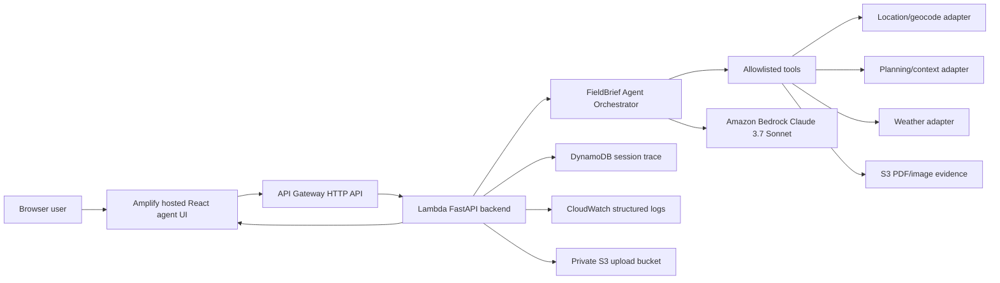

# Hosted AWS Product Path

3D-RAMS is being rebuilt as a hosted browser-based pre-visit agent product. The tester path is a normal URL, not Codespaces, local Python, Node, or AWS CLI.

## Target Experience

The user opens the hosted frontend, enters a shared test access code, then asks in natural language:

> I want to go for a site visit at 8 Albert Embankment tomorrow. Please prepare a pre-visit RAMS-style review pack.

The backend runs the agent workflow server-side and returns:

- assistant response;
- 3D site risk scene;
- risk review cards;
- evidence register;
- tool trace;
- confidence/fallback notes;
- safety gate result;
- RAMS-style review pack for human review.

The product does not produce certified RAMS, emergency guidance, work approval, or a competent-person replacement.

## AWS Architecture



## Current Implementation Status

Implemented and hosted for the MVP:

- chat-first React product surface;
- session start endpoint with shared-code access model;
- hosted-style `/api/chat` endpoint;
- upload metadata and S3 presign adapter;
- DynamoDB session trace with TTL;
- Lambda adapter via Mangum behind API Gateway HTTP API;
- Amplify-hosted frontend;
- CloudWatch structured events for session start, upload-url, chat start/end, safety, fallback, model-call count, and latency;
- Strands-ready backend dependency and orchestrator boundary, with existing deterministic tools still used as the current execution core;
- server-side Bedrock/fallback boundary using Claude 3.7 Sonnet in `eu-west-2`;
- visible map, evidence, trace, risk, and safety panels.

Hosted MVP endpoints and resources:

- frontend: <https://main.d62sagixyhsmv.amplifyapp.com>;
- API Gateway: `https://1rfpw4fi53.execute-api.eu-west-2.amazonaws.com`;
- Lambda: `3d-rams-mvp-api`;
- DynamoDB: `3d-rams-mvp-sessions`;
- S3 bucket: private MVP upload bucket with 7-day lifecycle deletion;
- CloudWatch log group: `/aws/lambda/3d-rams-mvp-api`.

Still deferred:

- CloudWatch dashboard/log queries;
- AgentCore Observability;
- Cognito login;
- richer live data adapters beyond current cached-public/synthetic fallback shape.

## V2 Durable Runtime Branch

The `feature/durable-runs-tool-loop` branch adds durable run APIs without replacing this hosted MVP:

- `POST /api/runs` creates a `runId` and initial checkpoint;
- `GET /api/runs/{runId}` lets the frontend poll/reconnect;
- `POST /api/runs/{runId}/cancel` records cancellation;
- the backend executes only allowlisted tools from a registry;
- planner, reasoner, and compiler phases have separate token budgets;
- the branch remains local/memory-backed until a separate v2 test stack is reviewed.

Future AWS shape for v2 is API Gateway/Lambda to a DynamoDB run table, SQS queue, worker Lambda, Bedrock, and CloudWatch. Step Functions remains a later option if the workflow stabilizes into fixed auditable phases.

See [durable-runtime-v2.md](durable-runtime-v2.md).

## Security And Cost Boundaries

- Bedrock is called only from the backend.
- No AWS credentials are sent to the frontend.
- Shared access code is checked before model calls.
- Unauthorized requests must return `401`.
- CORS should allow only the Amplify URL and local dev URLs.
- S3 uploads should use private bucket access and lifecycle deletion.
- DynamoDB stores run metadata, not raw credentials or private documents.
- CloudWatch logs should avoid uploaded file contents and access codes.
- Keep Bedrock use bounded by budget, max tokens, low temperature, and model-call cap.

## MVP Environment Variables

Backend:

```bash
APP_ENV=hosted
ALLOWED_ORIGINS=https://your-amplify-domain.example
APP_ACCESS_TOKEN_HASH=<sha256 access code hash>
APP_ACCESS_CODE_LABEL=team-test
ENABLE_BEDROCK=true
AWS_REGION=eu-west-2
BEDROCK_MODEL_ID=anthropic.claude-3-7-sonnet-20250219-v1:0
BEDROCK_MAX_TOKENS=1200
BEDROCK_TEMPERATURE=0.2
BEDROCK_MAX_MODEL_CALLS=2
S3_UPLOAD_BUCKET=<private evidence bucket>
DYNAMODB_SESSION_TABLE=<session trace table>
UPLOAD_RETENTION_DAYS=7
```

Generate the access-code hash locally and store only the hash in backend settings:

```bash
python -c "import hashlib; print(hashlib.sha256('replace-with-private-test-code'.encode()).hexdigest())"
```

Do not commit the raw access code or the real hash if it identifies a live test environment.

Frontend:

```bash
VITE_API_BASE_URL=https://your-api-gateway-domain.example
VITE_CESIUM_ION_TOKEN=
```

## Deployment Gates

1. Local chat-agent contract passes. Complete.
2. Backend is deployed behind API Gateway and blocks unauthorized requests. Complete.
3. Amplify frontend calls hosted backend. Complete by build/config; browser-click automation is limited by the current in-app browser controller, but hosted assets and CORS are verified.
4. Teammate test pack uses URL + access code only. Ready for quality review.
5. CloudWatch/DynamoDB evidence is reviewed before stronger production-readiness claims. Initial evidence complete; dashboard remains deferred.

## Deferred

- Cognito login;
- AgentCore Observability;
- Google Earth / Google 3D tiles;
- full planning-portal scraping;
- news/live incidents;
- grid/infrastructure hazard feeds;
- certified RAMS document generation.
